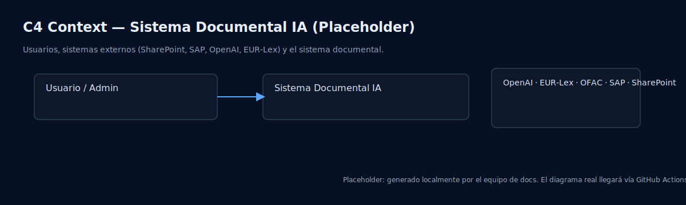
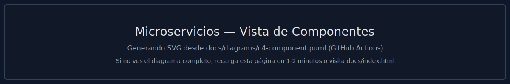
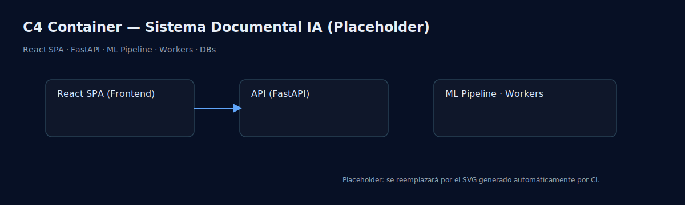

# Sistema Corporativo Documental con Capacidades de IA

  

Plataforma enterprise para ingestión, procesamiento y búsqueda de documentos con IA (OCR, NER, embeddings, RAG) y módulos de cumplimiento (EU AI Act, GDPR). Optimizada para GPU y operación en producción.

Links rápidos: [Inicio rápido](#inicio-rápido)  [Documentación](docs/)  [Diagramas (SVG)](docs/generated-diagrams/)  [Vista interactiva](docs/index.html)

---

## Resumen ejecutivo

Solución endtoend que integra pipelines de ML, búsqueda híbrida (léxica + semántica), almacenamiento de objetos y base vectorial para habilitar casos de uso corporativos: clasificación, extracción de entidades, validación de compliance y análisis de riesgo. Arquitectura modular, observable y escalable con componentes desacoplados.

---

## Arquitectura (visual listo para presentar)

Vista ejecutiva de microservicios:

Vista de contexto (C4):

Vista de microservicios (C4-Componentes):

Vista de contenedores (C4):

Nota: Los SVG se generan automáticamente desde docs/diagrams/ mediante GitHub Actions. Si aún no aparecen, consulta la versión interactiva en docs/index.html.

---

## Características principales

- Ingesta y procesamiento documental a escala (PDF/Office/Imagen) con OCR.
- Búsqueda híbrida + RAG con citación de fuentes y trazabilidad.
- Extracción de entidades (NER) y clasificación automática.
- Módulos de cumplimiento (GDPR, EU AI Act) con auditoría de evidencias.
- Observabilidad de LLMs y métricas operativas (latencia, throughput, errores).
- Despliegue reproducible con Docker Compose; listo para CI/CD.

---

## Stack tecnológico

- Backend: FastAPI (Python 3.11), SQLAlchemy, Celery.
- Frontend: React 18, TypeScript, Vite.
- Datos: PostgreSQL, Qdrant (vectores), Redis, MinIO (S3).
- ML/IA: OpenAI/SBERT, SpaCy, PyTorch.
- DevOps: Docker Compose, GitHub Actions, NGINX.

---

## Inicio rápido

1) Clona el repositorio
`powershell
git clone https://github.com/rjamoriz/Sistema-Corporativo-Documental-con-Capacidades-de-IA.git
cd "Sistema-Corporativo-Documental-con-Capacidades-de-IA"
`

2) Configura variables de entorno
`powershell
copy .env.example .env
# Edita .env (OPENAI_API_KEY y demás credenciales)
`

3) Levanta los servicios
`powershell
docker-compose up -d
`
Accesos:
- Frontend: http://localhost:3000
- Backend (OpenAPI): http://localhost:8000/docs

---

## Documentación

- docs/ARCHITECTURE.md  Arquitectura técnica
- docs/ADMIN_GUIDE.md  Guía de administración
- docs/USER_GUIDE.md  Manual de usuario
- docs/API_REFERENCE.md  Referencia API

---

 2024-2025 TeFinancia S.A.  Uso propietario
