# 🚀 FinancIA 2030 - Sistema Corporativo Documental con IA

   

**Plataforma enterprise de gestión documental inteligente** con capacidades avanzadas de IA para procesamiento, clasificación, búsqueda semántica y análisis de riesgo. Diseñada para entornos financieros y corporativos con requisitos estrictos de cumplimiento normativo.

**Links rápidos:** [🚀 Inicio rápido](#-inicio-rápido) | [📚 Documentación](docs/) | [🏗️ Arquitectura](#-arquitectura-de-la-solución) | [🎯 Características](#-características-principales)

---

## 📋 Tabla de Contenidos

- [Resumen Ejecutivo](#-resumen-ejecutivo)
- [Arquitectura de la Solución](#-arquitectura-de-la-solución)
- [Características Principales](#-características-principales)
- [Funcionalidades Clave](#-funcionalidades-clave)
- [Stack Tecnológico](#-stack-tecnológico)
- [Inicio Rápido](#-inicio-rápido)
- [Documentación](#-documentación)

---

## 🎯 Resumen Ejecutivo

**FinancIA 2030** es una solución end-to-end de gestión documental corporativa que integra:

- **🤖 Inteligencia Artificial**: OCR, NER, clasificación automática, embeddings semánticos y RAG
- **🔍 Búsqueda Híbrida**: Combinación de búsqueda léxica (BM25) y semántica (vectores)
- **⚖️ Cumplimiento Normativo**: EU AI Act 2024, GDPR/LOPDGDD, NIS2, ISO 27001/27701/42001
- **📊 Análisis de Riesgo**: Scoring multidimensional con explicabilidad total
- **🔐 Seguridad Enterprise**: Autenticación SSO/MFA, cifrado end-to-end, auditoría completa
- **📈 Observabilidad**: Monitoreo de LLMs con Arize Phoenix, métricas operativas en tiempo real

### Casos de Uso

✅ **Gestión de contratos** - Clasificación, extracción de cláusulas, alertas de vencimiento  
✅ **Compliance financiero** - Validación automática de documentación regulatoria  
✅ **Análisis de riesgo** - Scoring de documentos con explicabilidad  
✅ **Búsqueda inteligente** - RAG conversacional con citación de fuentes  
✅ **Procesamiento masivo** - Ingestión y OCR de miles de documentos  
✅ **Auditoría y trazabilidad** - Logs inmutables de todas las operaciones

---

## 🏗️ Arquitectura de la Solución

### Vista de Alto Nivel


### Pipeline de Procesamiento Documental


### Arquitectura de Microservicios (Vista Detallada)

```mermaid
graph TB
    subgraph "Frontend Layer"
        FE[React SPA<br/>Port 3000]
    end
    
    subgraph "Backend Services - Port 8000"
        direction TB
        AUTH[🔐 Auth Module<br/>JWT + SSO]
        DOCS[📄 Documents API<br/>/api/v1/documents]
        SRCH[🔍 Search API<br/>/api/v1/search]
        RAGAPI[🤖 RAG API<br/>/api/v1/rag]
        MLAPI[🧠 ML API<br/>/api/v1/ml]
        RISKAPI[⚠️ Risk API<br/>/api/v1/risk]
        COMPAPI[⚖️ Compliance API<br/>/api/v1/compliance]
        SYNTHAPI[🧬 Synthetic API<br/>/api/v1/synthetic]
        GRAPHQL[📊 GraphQL API<br/>/graphql]
    end
    
    subgraph "Processing Layer"
        WORKER1[Celery Worker 1<br/>OCR + Transform]
        WORKER2[Celery Worker 2<br/>ML + Classification]
        WORKER3[Celery Worker 3<br/>Embeddings + Index]
    end
    
    subgraph "Data Layer"
        direction LR
        DB1[(PostgreSQL<br/>Metadata + Users)]
        DB2[(OpenSearch<br/>Full-Text Search)]
        DB3[(Qdrant<br/>Vector Search)]
        DB4[(Redis<br/>Queue + Cache)]
        DB5[(MinIO<br/>Object Storage)]
    end
    
    FE -->|REST/GraphQL| AUTH
    AUTH --> DOCS
    AUTH --> SRCH
    AUTH --> RAGAPI
    AUTH --> MLAPI
    AUTH --> RISKAPI
    AUTH --> COMPAPI
    AUTH --> SYNTHAPI
    AUTH --> GRAPHQL
    
    DOCS --> WORKER1
    MLAPI --> WORKER2
    SRCH --> WORKER3
    
    WORKER1 --> DB4
    WORKER2 --> DB4
    WORKER3 --> DB4
    
    DOCS --> DB1
    DOCS --> DB5
    SRCH --> DB2
    SRCH --> DB3
    RAGAPI --> DB3
    MLAPI --> DB1
    RISKAPI --> DB1
    COMPAPI --> DB1
    
    style FE fill:#4FC3F7,stroke:#0277BD,stroke-width:3px,color:#000
    style AUTH fill:#EF5350,stroke:#B71C1C,stroke-width:3px,color:#fff
    style DOCS fill:#BA68C8,stroke:#6A1B9A,stroke-width:2px,color:#fff
    style SRCH fill:#9575CD,stroke:#4527A0,stroke-width:2px,color:#fff
    style RAGAPI fill:#7E57C2,stroke:#311B92,stroke-width:2px,color:#fff
    style MLAPI fill:#5C6BC0,stroke:#1A237E,stroke-width:2px,color:#fff
    style RISKAPI fill:#66BB6A,stroke:#1B5E20,stroke-width:2px,color:#000
    style COMPAPI fill:#4CAF50,stroke:#2E7D32,stroke-width:2px,color:#000
    style SYNTHAPI fill:#81C784,stroke:#388E3C,stroke-width:2px,color:#000
    style GRAPHQL fill:#26C6DA,stroke:#006064,stroke-width:2px,color:#000
    style WORKER1 fill:#FFA726,stroke:#E65100,stroke-width:2px,color:#000
    style WORKER2 fill:#FFB74D,stroke:#EF6C00,stroke-width:2px,color:#000
    style WORKER3 fill:#FFCC80,stroke:#F57C00,stroke-width:2px,color:#000
    style DB1 fill:#42A5F5,stroke:#0D47A1,stroke-width:2px,color:#fff
    style DB2 fill:#26C6DA,stroke:#006064,stroke-width:2px,color:#000
    style DB3 fill:#AB47BC,stroke:#4A148C,stroke-width:2px,color:#fff
    style DB4 fill:#EF5350,stroke:#B71C1C,stroke-width:2px,color:#fff
    style DB5 fill:#FF7043,stroke:#BF360C,stroke-width:2px,color:#fff
```



---

## ✨ Características Principales

### 🤖 Inteligencia Artificial

- **OCR Avanzado**: Tesseract + PyTesseract para documentos escaneados
- **NER (Named Entity Recognition)**: Extracción de personas, organizaciones, DNI, IBAN, fechas
- **Clasificación Automática**: Modelo BETO fine-tuned para 10+ categorías documentales
- **Embeddings Semánticos**: Sentence-BERT para representación vectorial
- **RAG (Retrieval Augmented Generation)**: Asistente conversacional con citación obligatoria

### 🔍 Búsqueda y Recuperación

- **Búsqueda Híbrida**: Combina BM25 (léxica) + vectores (semántica) con re-ranking
- **Filtros Avanzados**: Por tipo, fecha, autor, categoría, riesgo, compliance
- **Búsqueda Facetada**: Agregaciones y estadísticas en tiempo real
- **Búsqueda Conversacional**: Interfaz de chat con contexto histórico

### ⚖️ Cumplimiento Normativo

- **EU AI Act 2024**: Clasificación de riesgo, documentación obligatoria, auditoría
- **GDPR/LOPDGDD**: Anonimización, derecho al olvido, consentimiento
- **NIS2 Directive**: Ciberseguridad, gestión de incidentes
- **ISO 27001/27701/42001**: Gestión de seguridad y privacidad
- **Motor de Reglas**: Validación automática de compliance con evidencias

### 📊 Análisis y Reporting

- **Scoring de Riesgo**: Análisis multidimensional (legal, financiero, operacional)
- **Explicabilidad**: Cada decisión con evidencias y razonamiento
- **Dashboards Interactivos**: Métricas operativas y de negocio
- **Alertas Automáticas**: Notificaciones de vencimientos, anomalías, incumplimientos

### 🔐 Seguridad Enterprise

- **Autenticación**: SSO, LDAP/AD, MFA
- **Autorización**: RBAC granular por documento y operación
- **Cifrado**: TLS 1.3 en tránsito, AES-256 en reposo
- **Auditoría**: Logs inmutables de todas las operaciones
- **Anonimización**: PII detection y enmascaramiento automático

---

## 🎯 Funcionalidades Clave

### 📄 Gestión Documental

| Funcionalidad | Descripción |
|---------------|-------------|
| **Ingestión Multi-canal** | Upload web, API REST, conectores (SharePoint, SAP DMS), carpetas vigiladas |
| **Procesamiento Automático** | OCR, conversión de formatos, normalización, extracción de metadatos |
| **Versionado** | Control de versiones con diff visual y rollback |
| **Deduplicación** | Detección automática de duplicados por hash SHA-256 |
| **Comparación** | Diff side-by-side de documentos con highlighting |
| **Anotaciones** | Sistema de comentarios y marcado colaborativo |

### 🔍 Búsqueda Inteligente

| Funcionalidad | Descripción |
|---------------|-------------|
| **Búsqueda Full-Text** | Indexación completa con OpenSearch (BM25) |
| **Búsqueda Semántica** | Vectores con Qdrant para búsqueda por significado |
| **Búsqueda Híbrida** | Fusión de resultados léxicos y semánticos con re-ranking |
| **Filtros Dinámicos** | Por tipo, fecha, categoría, autor, riesgo, compliance |
| **Sugerencias** | Autocompletado y corrección ortográfica |
| **Historial** | Búsquedas recientes y guardadas |

### 🤖 Asistente IA (RAG)

| Funcionalidad | Descripción |
|---------------|-------------|
| **Chat Conversacional** | Interfaz de chat con contexto histórico |
| **Citación Obligatoria** | Cada respuesta con fuentes y extractos relevantes |
| **Multi-documento** | Respuestas que sintetizan información de múltiples docs |
| **Explicabilidad** | Razonamiento paso a paso de las respuestas |
| **Observabilidad** | Monitoreo de prompts, latencia, tokens con Arize Phoenix |

### 📊 Análisis de Riesgo

| Funcionalidad | Descripción |
|---------------|-------------|
| **Scoring Multidimensional** | Legal, financiero, operacional, reputacional |
| **Explicabilidad Total** | Evidencias y factores que contribuyen al score |
| **Alertas Automáticas** | Notificaciones de documentos de alto riesgo |
| **Tendencias** | Evolución del riesgo en el tiempo |
| **Reportes** | Informes ejecutivos y detallados |

### ⚖️ Compliance

| Funcionalidad | Descripción |
|---------------|-------------|
| **Motor de Reglas** | Validación automática de requisitos normativos |
| **Auditoría Completa** | Logs inmutables de todas las validaciones |
| **Evidencias** | Captura automática de pruebas de cumplimiento |
| **Alertas de Vencimiento** | Notificaciones de documentos próximos a expirar |
| **Reportes Regulatorios** | Generación automática de informes para autoridades |

### 🧬 Datos Sintéticos

| Funcionalidad | Descripción |
|---------------|-------------|
| **Generación Automática** | Creación de documentos sintéticos para testing |
| **Templates Configurables** | Distribuciones predefinidas (default, financial, contracts) |
| **Auto-upload** | Carga automática de documentos generados |
| **Historial** | Seguimiento de generaciones con métricas |

---

## 🛠️ Stack Tecnológico

### Backend

| Componente | Tecnología | Versión | Propósito |
|------------|-----------|---------|-----------|
| **Framework** | FastAPI | 0.104+ | API REST de alto rendimiento |
| **ORM** | SQLAlchemy | 2.0+ | Abstracción de base de datos |
| **Task Queue** | Celery | 5.3+ | Procesamiento asíncrono |
| **Auth** | JWT + OAuth2 | - | Autenticación y autorización |
| **Validación** | Pydantic | 2.0+ | Validación de datos |

### Frontend

| Componente | Tecnología | Versión | Propósito |
|------------|-----------|---------|-----------|
| **Framework** | React | 18+ | UI interactiva |
| **Lenguaje** | TypeScript | 5.0+ | Type safety |
| **Build Tool** | Vite | 4.0+ | Build rápido y HMR |
| **UI Library** | Material-UI | 5.0+ | Componentes profesionales |
| **State Management** | React Query | 4.0+ | Gestión de estado servidor |
| **Routing** | React Router | 6.0+ | Navegación SPA |

### Datos y Almacenamiento

| Componente | Tecnología | Versión | Propósito |
|------------|-----------|---------|-----------|
| **Base de Datos** | PostgreSQL | 15+ | Datos relacionales + pgvector |
| **Full-Text Search** | OpenSearch | 2.11+ | Búsqueda léxica (BM25) |
| **Vector Database** | Qdrant | 1.7+ | Búsqueda semántica |
| **Cache** | Redis | 7.0+ | Cache + cola de tareas |
| **Object Storage** | MinIO | Latest | Almacenamiento S3-compatible |

### Machine Learning e IA

| Componente | Tecnología | Versión | Propósito |
|------------|-----------|---------|-----------|
| **LLM** | OpenAI GPT-4 | - | RAG y generación de texto |
| **Embeddings** | Sentence-BERT | - | Vectorización semántica |
| **NER** | SpaCy | 3.7+ | Extracción de entidades |
| **OCR** | Tesseract | 5.0+ | Reconocimiento de texto |
| **ML Framework** | PyTorch | 2.0+ | Modelos personalizados |
| **Observability** | Arize Phoenix | Latest | Monitoreo de LLMs |

### DevOps e Infraestructura

| Componente | Tecnología | Versión | Propósito |
|------------|-----------|---------|-----------|
| **Containerización** | Docker | 24+ | Empaquetado de servicios |
| **Orquestación** | Docker Compose | 2.0+ | Orquestación local |
| **CI/CD** | GitHub Actions | - | Automatización de pipelines |
| **Reverse Proxy** | NGINX | 1.25+ | Load balancing y SSL |
| **Monitoring** | Prometheus + Grafana | - | Métricas y alertas |

---

## 🚀 Inicio Rápido

### Prerrequisitos

- **Docker** 24.0+ y **Docker Compose** 2.0+
- **Git** para clonar el repositorio
- **8GB RAM** mínimo (16GB recomendado)
- **20GB** de espacio en disco
- **GPU NVIDIA** (opcional, para aceleración)

### Instalación Estándar

#### 1️⃣ Clonar el Repositorio

```powershell
git clone https://github.com/rjamoriz/Sistema-Corporativo-Documental-con-Capacidades-de-IA.git
cd Sistema-Corporativo-Documental-con-Capacidades-de-IA
```

#### 2️⃣ Configurar Variables de Entorno

```powershell
# Copiar el archivo de ejemplo
copy .env.example .env

# Editar .env con tus credenciales
notepad .env
```

**Variables críticas a configurar:**

```env
# OpenAI API (requerido para RAG)
OPENAI_API_KEY=sk-...

# Base de datos
POSTGRES_PASSWORD=tu_password_seguro

# MinIO (S3)
MINIO_ROOT_USER=admin
MINIO_ROOT_PASSWORD=tu_password_seguro

# JWT Secret
JWT_SECRET_KEY=genera_un_secret_aleatorio_seguro
```

#### 3️⃣ Levantar los Servicios

```powershell
# Modo estándar (CPU)
docker-compose up -d

# Modo GPU (si tienes NVIDIA GPU)
docker-compose -f docker-compose.gpu.yml up -d
```

#### 4️⃣ Verificar el Despliegue

```powershell
# Verificar que todos los contenedores están corriendo
docker ps

# Ver logs del backend
docker logs financia_backend -f
```

#### 5️⃣ Acceder a la Aplicación

| Servicio | URL | Credenciales |
|----------|-----|--------------|
| **Frontend** | http://localhost:3000 | admin@demo.documental.com / Demo2025! |
| **Backend API** | http://localhost:8000/docs | - |
| **MinIO Console** | http://localhost:9001 | admin / [tu_password] |
| **Phoenix UI** | http://localhost:6006 | - |
| **OpenSearch** | http://localhost:9200 | admin / admin |

### Instalación con GPU (Aceleración NVIDIA)

Para aprovechar la aceleración GPU en OCR y ML:

```powershell
# 1. Instalar NVIDIA Container Toolkit
# Seguir: https://docs.nvidia.com/datacenter/cloud-native/container-toolkit/install-guide.html

# 2. Verificar GPU disponible
nvidia-smi

# 3. Levantar con configuración GPU
docker-compose -f docker-compose.gpu.yml up -d
```

### Primeros Pasos

1. **Login**: Accede a http://localhost:3000 con las credenciales de demo
2. **Subir Documentos**: Ve a "Documentos" → "Subir" y carga tus primeros archivos
3. **Búsqueda**: Prueba la búsqueda híbrida en la barra superior
4. **RAG**: Abre el "Asistente IA" y haz preguntas sobre tus documentos
5. **Dashboard**: Explora las métricas en el panel de administración

### Scripts de Utilidad

```powershell
# Verificar estado del sistema
.\verify_system.ps1

# Reiniciar servicios
docker-compose restart

# Ver logs de todos los servicios
docker-compose logs -f

# Detener todos los servicios
docker-compose down

# Limpiar volúmenes (⚠️ borra datos)
docker-compose down -v
```

---

## 📚 Documentación

### Guías de Usuario

- **[📖 Manual de Usuario](docs/USER_GUIDE.md)** - Guía completa para usuarios finales
- **[🎬 Script de Demo](docs/DEMO_SCRIPT.md)** - Demostración guiada de funcionalidades
- **[🧬 Generador de Datos Sintéticos](docs/SYNTHETIC_DATA_GUIDE.md)** - Cómo generar datos de prueba

### Guías Técnicas

- **[🏗️ Arquitectura del Sistema](docs/ARCHITECTURE.md)** - Diseño técnico detallado
- **[🔧 Guía de Administración](docs/ADMIN_GUIDE.md)** - Configuración y mantenimiento
- **[🚀 Guía de Despliegue](docs/DEPLOYMENT_GUIDE.md)** - Despliegue en producción
- **[📡 Referencia API](docs/API_REFERENCE.md)** - Documentación completa de endpoints

### Guías Especializadas

- **[🔌 Conectores](docs/CONNECTORS_GUIDE.md)** - Integración con SharePoint, SAP DMS, etc.
- **[📊 GraphQL](docs/GRAPHQL_QUICKSTART.md)** - API GraphQL y ejemplos
- **[🔍 SPARQL](docs/SPARQL_EXAMPLES.md)** - Consultas sobre ontología
- **[👁️ Observabilidad Phoenix](docs/PHOENIX_OBSERVABILITY.md)** - Monitoreo de LLMs
- **[⚖️ Compliance y Gobernanza](docs/GOVERNANCE.md)** - Cumplimiento normativo

### Documentación de Desarrollo

- **[🧪 Guía de Testing](docs/IMPLEMENTATION_GUIDE.md)** - Testing y QA
- **[🔐 Análisis de Riesgo](docs/RFP_ANALYSIS.md)** - Análisis de requisitos
- **[📋 Sistema de Validación](docs/VALIDATION_SYSTEM.md)** - Validación de compliance

---

## 🤝 Soporte y Contacto

### Soporte Técnico

- **Email**: financia2030@tefinancia.es
- **Documentación**: [docs/](docs/)
- **Issues**: GitHub Issues (repositorio privado)

### Equipo de Desarrollo

**TeFinancia S.A. - FinancIA 2030 Team**

---

## 📄 Licencia

© 2024-2025 **TeFinancia S.A.** - Todos los derechos reservados

Este software es **propietario** y confidencial. El uso, copia, modificación o distribución no autorizada está estrictamente prohibido.

Para consultas sobre licenciamiento: legal@tefinancia.es

---

## 🎯 Roadmap

### ✅ Completado (v1.0)

- ✅ Pipeline completo de procesamiento documental
- ✅ Búsqueda híbrida (léxica + semántica)
- ✅ RAG con citación obligatoria
- ✅ Análisis de riesgo multidimensional
- ✅ Motor de compliance con EU AI Act
- ✅ Observabilidad con Arize Phoenix
- ✅ Conectores SharePoint y SAP DMS
- ✅ API GraphQL
- ✅ Sistema de anotaciones
- ✅ Comparación de documentos

### 🚧 En Desarrollo (v1.1)

- 🚧 Integración con Microsoft Teams
- 🚧 Workflow de aprobaciones
- 🚧 Firma electrónica
- 🚧 Mobile app (iOS/Android)
- 🚧 Exportación a blockchain

### ⚛️ Planificado (v2.0) - Quantum & GPU Enhancement

**🚀 Plan de Mejora Integral con Computación Cuántica y Aceleración GPU**

Ver documento completo: **[QUANTUM_GPU_ENHANCEMENT_PLAN.md](docs/QUANTUM_GPU_ENHANCEMENT_PLAN.md)**

**Objetivos principales:**

- ⚡ **Aceleración GPU (NVIDIA RTX)**: Embeddings y FAISS-GPU para reducir tiempo de indexado > 80%
- ⚛️ **Computación Cuántica**: Optimización QUBO para deduplicación y clustering (D-Wave + IBM Qiskit + NVIDIA cuQuantum)
- 🧠 **Quantum Machine Learning**: Kernels cuánticos para clasificación avanzada
- 🤖 **RAG Optimizado**: LLMs con contexto mejorado y trazabilidad 100%
- 📊 **Observabilidad Avanzada**: Prometheus + Grafana + Arize Phoenix

**Componentes nuevos (modulares, sin romper app actual):**

1. `gpu-embedding-service` - Aceleración de embeddings con GPU
2. `quantum-dedupe-dwave` - Deduplicación con D-Wave Ocean SDK
3. `quantum-dedupe-ibm` - Deduplicación con IBM Qiskit
4. `qml-classifier-nvidia` - ML cuántico con cuQuantum
5. `rag-enhanced-service` - RAG optimizado con GPU

**Beneficios esperados:**

- 🚀 Ingestión 3-5× más rápida
- 🎯 +15% precisión en deduplicación
- 📉 -20-30% reducción en revisión manual
- ⚛️ Capacidades de investigación cuántica sin hardware externo

### 🔮 Futuro (v3.0+)

- 🔮 Multi-tenancy completo
- 🔮 IA explicable (XAI) avanzada
- 🔮 Federación de búsqueda
- 🔮 Integración con ERP/CRM
- 🔮 Análisis predictivo con quantum computing

---

<div align="center">

**⭐ Si este proyecto te resulta útil, considera darle una estrella ⭐**

Hecho con ❤️ por el equipo de **FinancIA 2030**

</div>
