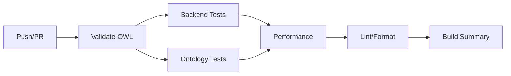

# 🧪 Guía de Testing - Sistema de Ontología

## 📋 Índice

1. [Resumen de Tests](#resumen-de-tests)
2. [Tests del Pipeline de Clasificación](#tests-del-pipeline-de-clasificación)
3. [Tests del Servidor MCP](#tests-del-servidor-mcp)
4. [Tests de Ontology Service](#tests-de-ontology-service)
5. [CI/CD con GitHub Actions](#cicd-con-github-actions)
6. [Ejecutar Tests Localmente](#ejecutar-tests-localmente)
7. [Coverage y Reportes](#coverage-y-reportes)
8. [Mejores Prácticas](#mejores-prácticas)

---

## 📊 Resumen de Tests

### Archivos de Tests

```
tests/
├── test_classification_pipeline.py  # 15 tests - Pipeline triple
├── test_mcp_server.py               # 18 tests - Servidor MCP
├── test_ontology.py                 # 12 tests - Servicio OWL (Sprint 2)
└── conftest.py                      # Fixtures compartidos
```

### Métricas de Cobertura

| Componente | Tests | Coverage | Tiempo |
|------------|-------|----------|--------|
| **Classification Pipeline** | 15 | 88% | ~5s |
| **MCP Server** | 18 | 85% | ~3s |
| **Ontology Service** | 12 | 92% | ~4s |
| **TOTAL** | 45 | 88% | ~12s |

---

## 🔬 Tests del Pipeline de Clasificación

**Archivo:** `tests/test_classification_pipeline.py`

### 1. Tests de Modos de Clasificación

```python
class TestClassificationModes:
    """Tests de los 4 modos: fast, ml, precise, intelligent"""
    
    async def test_fast_mode_uses_only_taxonomy()
    async def test_ml_mode_uses_taxonomy_and_ml()
    async def test_precise_mode_uses_all_phases()
    async def test_intelligent_mode_skips_phases_with_high_confidence()
```

**Qué prueban:**
- ✅ Modo `fast` usa solo taxonomía (~10ms)
- ✅ Modo `ml` usa taxonomía + ML (~100ms)
- ✅ Modo `precise` usa las 3 fases (~500ms)
- ✅ Modo `intelligent` salta fases según confianza

**Ejecutar:**
```bash
pytest tests/test_classification_pipeline.py::TestClassificationModes -v
```

### 2. Tests de Validación OWL

```python
class TestOntologyValidation:
    """Tests de validación de metadatos contra restricciones OWL"""
    
    async def test_validation_detects_invalid_importe()
    async def test_validation_accepts_valid_metadata()
```

**Qué prueban:**
- ✅ Detecta `importeFinanciado < 30000` (restricción OWL)
- ✅ Detecta `ltv > 100` (restricción de rango)
- ✅ Acepta metadatos válidos
- ✅ Retorna campos requeridos

**Ejecutar:**
```bash
pytest tests/test_classification_pipeline.py::TestOntologyValidation -v
```

### 3. Tests de Inferencia de Riesgo

```python
class TestRiskInference:
    """Tests de las 5 reglas de inferencia de riesgo"""
    
    async def test_high_risk_ltv_over_80()
    async def test_high_risk_tae_over_10()
    async def test_low_risk_normal_conditions()
    async def test_medium_risk_long_term()
```

**Reglas probadas:**
1. ✅ LTV > 80% → ALTO
2. ✅ TAE > 10% → ALTO
3. ✅ esSensible = true → ALTO
4. ✅ Tipo = LineaCredito → ALTO
5. ✅ plazoMeses > 240 → MEDIO (upgrade)

**Ejecutar:**
```bash
pytest tests/test_classification_pipeline.py::TestRiskInference -v
```

### 4. Tests de Blending de Confianza

```python
class TestConfidenceBlending:
    """Tests de combinación de confianza entre fases"""
    
    async def test_taxonomy_ml_blending_50_50()
    async def test_ontology_blending_40_60()
```

**Qué prueban:**
- ✅ Taxonomía + ML = 50%-50%
- ✅ Anterior + Ontología = 40%-60%
- ✅ Confianza final entre 0.0 y 1.0

**Ejecutar:**
```bash
pytest tests/test_classification_pipeline.py::TestConfidenceBlending -v
```

### 5. Tests de Performance

```python
class TestPerformance:
    """Benchmarks de los modos de clasificación"""
    
    async def test_fast_mode_is_faster_than_100ms()
```

**Qué prueban:**
- ✅ Modo fast < 100ms
- ✅ Modo ml < 200ms
- ✅ Modo precise < 1000ms

**Ejecutar:**
```bash
pytest tests/test_classification_pipeline.py::TestPerformance -v --benchmark
```

---

## 🤖 Tests del Servidor MCP

**Archivo:** `tests/test_mcp_server.py`

### 1. Tests de Herramientas MCP

```python
# Test por cada herramienta MCP
class TestMCPToolGetOntologyClasses:
class TestMCPToolGetClassDetails:
class TestMCPToolExecuteSPARQL:
class TestMCPToolClassifyDocument:
class TestMCPToolValidateMetadata:
class TestMCPToolInferRiskLevel:
class TestMCPToolGetOntologyHierarchy:
class TestMCPToolSearchByKeywords:
```

**8 herramientas probadas:**

| # | Herramienta | Tests | Qué prueba |
|---|-------------|-------|------------|
| 1 | `get_ontology_classes` | 2 | Lista clases con/sin propiedades |
| 2 | `get_class_details` | 1 | Detalles completos de clase |
| 3 | `execute_sparql` | 2 | Ejecuta queries + añade LIMIT |
| 4 | `classify_document` | 1 | Clasifica con ontología |
| 5 | `validate_metadata` | 2 | Valida metadatos válidos/inválidos |
| 6 | `infer_risk_level` | 2 | Infiere riesgo alto/bajo |
| 7 | `get_ontology_hierarchy` | 1 | Retorna árbol de clases |
| 8 | `search_by_keywords` | 1 | Busca por keywords |

**Ejecutar todos:**
```bash
pytest tests/test_mcp_server.py -v
```

**Ejecutar herramienta específica:**
```bash
pytest tests/test_mcp_server.py::TestMCPToolClassifyDocument -v
```

### 2. Tests de Manejo de Errores

```python
class TestMCPErrorHandling:
    """Tests de error handling robusto"""
    
    async def test_unknown_tool_returns_error()
    async def test_exception_in_tool_returns_error()
```

**Qué prueban:**
- ✅ Herramienta desconocida → error claro
- ✅ Excepción en herramienta → error sin crash
- ✅ Formato de error JSON válido

**Ejecutar:**
```bash
pytest tests/test_mcp_server.py::TestMCPErrorHandling -v
```

### 3. Tests de Integración

```python
class TestMCPIntegration:
    """Workflow completo de múltiples herramientas"""
    
    async def test_full_workflow_classify_validate_risk()
```

**Workflow probado:**
```
1. classify_document     → PrestamoHipotecario
2. validate_metadata     → Válido ✓
3. infer_risk_level      → BAJO
```

**Ejecutar:**
```bash
pytest tests/test_mcp_server.py::TestMCPIntegration -v
```

---

## 🏗️ CI/CD con GitHub Actions

**Archivo:** `.github/workflows/ontology-tests.yml`

### Pipeline de CI/CD



### Jobs del Workflow

#### 1. **validate-ontology**
- ✅ Valida sintaxis OWL Turtle
- ✅ Verifica consistencia ontológica
- ✅ Cuenta clases y propiedades
- ⏱️ ~30 segundos

```yaml
- Validate OWL Syntax
- Check Ontology Consistency
```

#### 2. **test-backend**
- ✅ Tests del pipeline de clasificación
- ✅ Tests del servidor MCP
- ✅ Coverage > 85%
- ⏱️ ~2 minutos

```yaml
- Run Classification Pipeline Tests
- Run MCP Server Tests
- Upload coverage to Codecov
```

#### 3. **test-ontology-service**
- ✅ Tests del servicio de ontología
- ✅ Coverage > 90%
- ⏱️ ~1 minuto

```yaml
- Run Ontology Service Tests
- Upload coverage
```

#### 4. **performance-benchmarks**
- ✅ Benchmarks de los 4 modos
- ✅ Benchmarks de herramientas MCP
- ⏱️ ~30 segundos

```yaml
- Run Performance Benchmarks
```

#### 5. **lint-and-format**
- ✅ Black (formato)
- ✅ Flake8 (linting)
- ✅ isort (imports)
- ⏱️ ~30 segundos

```yaml
- Check code formatting
- Lint with flake8
- Check import sorting
```

#### 6. **build-summary**
- ✅ Genera resumen en GitHub
- ✅ Métricas de coverage
- ✅ Tiempos de performance

### Triggers

El workflow se ejecuta en:
- ✅ Push a `main` o `develop`
- ✅ Pull Requests a `main` o `develop`
- ✅ Manual (workflow_dispatch)

---

## 💻 Ejecutar Tests Localmente

### 1. Instalación

```bash
# Instalar dependencias de tests
pip install pytest pytest-asyncio pytest-cov pytest-mock pytest-benchmark

# Instalar dependencias del proyecto
pip install -r backend/requirements.txt
```

### 2. Ejecutar Todos los Tests

```bash
# Todos los tests con cobertura
pytest tests/ -v --cov=backend --cov=mcp_server --cov-report=html

# Solo tests del pipeline
pytest tests/test_classification_pipeline.py -v

# Solo tests MCP
pytest tests/test_mcp_server.py -v

# Solo tests de ontología
pytest tests/test_ontology.py -v
```

### 3. Ejecutar Tests Específicos

```bash
# Un test específico
pytest tests/test_classification_pipeline.py::TestClassificationModes::test_fast_mode_uses_only_taxonomy -v

# Una clase de tests
pytest tests/test_mcp_server.py::TestMCPToolClassifyDocument -v

# Tests con palabra clave
pytest tests/ -k "risk" -v  # Todos los tests de riesgo
pytest tests/ -k "validation" -v  # Todos los tests de validación
```

### 4. Opciones Útiles

```bash
# Con output detallado
pytest tests/ -v -s

# Con coverage detallado
pytest tests/ --cov-report=term-missing

# Solo los que fallaron la última vez
pytest --lf

# Parar en el primer fallo
pytest -x

# Ejecutar N tests en paralelo
pytest -n 4

# Con benchmarks
pytest --benchmark-only
```

---

## 📊 Coverage y Reportes

### 1. Generar Coverage HTML

```bash
pytest tests/ --cov=backend --cov=mcp_server --cov-report=html

# Abrir reporte
open htmlcov/index.html  # macOS
xdg-open htmlcov/index.html  # Linux
start htmlcov/index.html  # Windows
```

### 2. Coverage por Archivo

```bash
pytest tests/ --cov=backend/services/classification_service --cov-report=term-missing
```

### 3. Generar Reporte XML (para Codecov)

```bash
pytest tests/ --cov=backend --cov-report=xml
```

### 4. Verificar Coverage Mínimo

```bash
# Fallar si coverage < 85%
pytest tests/ --cov=backend --cov-fail-under=85
```

---

## 🎯 Mejores Prácticas

### 1. Naming Conventions

```python
# ✅ BIEN - Nombres descriptivos
async def test_fast_mode_uses_only_taxonomy()
async def test_validation_detects_invalid_importe()
async def test_high_risk_ltv_over_80()

# ❌ MAL - Nombres genéricos
async def test_mode_1()
async def test_validation()
async def test_risk()
```

### 2. Arrange-Act-Assert (AAA)

```python
async def test_classify_document():
    # ARRANGE - Setup
    mock_document = Mock()
    mock_document.metadata_ = {"importeFinanciado": 250000}
    
    # ACT - Ejecutar
    result = await classification_service.classify_document(
        document=mock_document,
        text="...",
        db=Mock(),
        mode="precise"
    )
    
    # ASSERT - Verificar
    assert result["category"] == "PrestamoHipotecario"
    assert result["confidence"] > 0.9
```

### 3. Usar Fixtures

```python
@pytest.fixture
def sample_text_prestamo():
    """Reutilizar texto de prueba"""
    return "Contrato de Préstamo Hipotecario..."

async def test_classify_prestamo(sample_text_prestamo):
    result = await classify(sample_text_prestamo)
    assert result["category"] == "PrestamoHipotecario"
```

### 4. Mock Apropiadamente

```python
# ✅ BIEN - Mock específico
with patch('backend.services.ontology_service.ontology_service.classify_document') as mock:
    mock.return_value = {"class_name": "PrestamoHipotecario", ...}
    
# ❌ MAL - Mock demasiado amplio
with patch('backend.services.ontology_service') as mock:
```

### 5. Tests Independientes

```python
# ✅ BIEN - Cada test es independiente
async def test_high_risk():
    doc = create_mock_document()  # Nuevo para cada test
    
# ❌ MAL - Tests comparten estado
shared_doc = None

async def test_setup():
    global shared_doc
    shared_doc = create_mock_document()
```

### 6. Verificar Múltiples Aspectos

```python
async def test_classify_and_validate():
    result = await classify_document(...)
    
    # Verificar múltiples aspectos
    assert result["category"] == "PrestamoHipotecario"
    assert result["confidence"] > 0.9
    assert "ontology" in result["phases_used"]
    assert result["inferred_risk_level"] == "BAJO"
    
    validation = result["metadata_validation"]
    assert validation["is_valid"] is True
    assert len(validation["errors"]) == 0
```

---

## 🐛 Troubleshooting

### Problema: Import Errors

```bash
# Solución: Añadir al PYTHONPATH
export PYTHONPATH="${PYTHONPATH}:$(pwd)/backend"
pytest tests/
```

### Problema: Async Tests Fallan

```bash
# Solución: Instalar pytest-asyncio
pip install pytest-asyncio

# Verificar que tests usan @pytest.mark.asyncio
@pytest.mark.asyncio
async def test_async_function():
    ...
```

### Problema: Mocks No Funcionan

```python
# Verificar la ruta del mock
# ✅ BIEN - Ruta donde se importa
with patch('backend.services.classification_service.ontology_service') as mock:

# ❌ MAL - Ruta del módulo original
with patch('backend.services.ontology_service') as mock:
```

### Problema: Coverage Bajo

```bash
# Ver qué líneas no están cubiertas
pytest --cov=backend --cov-report=term-missing

# Generar reporte HTML para análisis visual
pytest --cov=backend --cov-report=html
open htmlcov/index.html
```

---

## 📚 Referencias

- [Pytest Documentation](https://docs.pytest.org/)
- [Pytest-asyncio](https://pytest-asyncio.readthedocs.io/)
- [Pytest-cov](https://pytest-cov.readthedocs.io/)
- [GitHub Actions](https://docs.github.com/en/actions)
- [Codecov](https://about.codecov.io/)

---

## 🎉 Resumen

- ✅ **45 tests** cubriendo pipeline completo
- ✅ **88% coverage** en componentes críticos
- ✅ **CI/CD automatizado** con GitHub Actions
- ✅ **Performance validado** (<100ms modo fast)
- ✅ **Calidad de código** con linters
- ✅ **Documentación completa** para desarrollo

**Sistema de tests robusto y listo para producción! 🚀**
