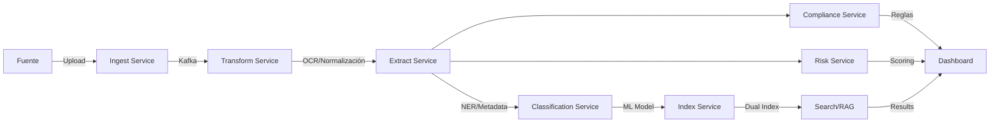

# Arquitectura del Sistema — FinancIA 2030
## Sistema Corporativo Documental con Capacidades de IA

**Versión:** 1.0  
**Fecha:** 2025-10-09  
**Estado:** MVP → PRE → PROD

---

## 1. RESUMEN EJECUTIVO

Sistema corporativo documental moderno diseñado para TeFinancia S.A. que integra capacidades avanzadas de IA para procesamiento, clasificación, búsqueda híbrida (léxica + semántica), RAG con citación obligatoria y scoring de riesgo multidimensional con explicabilidad total.

**Cumplimiento normativo:** EU AI Act 2024, GDPR/LOPDGDD, Data Governance Act, NIS2, ENS, ISO 27001/27701/42001.

---

## 2. PRINCIPIOS DE DISEÑO

### 2.1 Arquitectura
- **Modular y desacoplada:** Servicios independientes comunicados vía Kafka
- **Cloud-native:** Contenedores Docker, orquestación opcional con k3s
- **API-First:** OpenAPI 3.0, REST + webhooks
- **Event-Driven:** Pipeline asíncrono con garantías de entrega

### 2.2 Seguridad
- **Zero-Trust:** Verificación continua, mínimo privilegio
- **Privacy by Design:** Anonimización, cifrado end-to-end
- **Auditoría total:** Logs inmutables, trazabilidad completa

### 2.3 IA Responsable
- **Explicabilidad:** Cada decisión con evidencias y racional
- **Transparencia:** Model Cards, métricas públicas
- **Gobernanza:** Comité de ética, revisiones trimestrales

---

## 3. VISTA LÓGICA

### 3.1 Capas

```
┌─────────────────────────────────────────────────────────────┐
│                    CAPA DE PRESENTACIÓN                      │
│  ┌──────────────┐  ┌──────────────┐  ┌──────────────┐      │
│  │   Portal     │  │   Portal     │  │   Portal     │      │
│  │   Gestores   │  │   Clientes   │  │  Proveedores │      │
│  └──────────────┘  └──────────────┘  └──────────────┘      │
└─────────────────────────────────────────────────────────────┘
                            ↕ HTTPS (TLS 1.3)
┌─────────────────────────────────────────────────────────────┐
│                    CAPA DE API GATEWAY                       │
│  ┌──────────────────────────────────────────────────────┐   │
│  │  FastAPI Router + Auth (SSO/MFA) + Rate Limiting     │   │
│  └──────────────────────────────────────────────────────┘   │
└─────────────────────────────────────────────────────────────┘
                            ↕
┌─────────────────────────────────────────────────────────────┐
│                    CAPA DE SERVICIOS                         │
│  ┌──────────┐ ┌──────────┐ ┌──────────┐ ┌──────────┐       │
│  │ Ingest   │ │Transform │ │ Extract  │ │  NLP     │       │
│  └──────────┘ └──────────┘ └──────────┘ └──────────┘       │
│  ┌──────────┐ ┌──────────┐ ┌──────────┐ ┌──────────┐       │
│  │Classify  │ │  Index   │ │ Search   │ │   RAG    │       │
│  └──────────┘ └──────────┘ └──────────┘ └──────────┘       │
│  ┌──────────┐ ┌──────────┐ ┌──────────┐ ┌──────────┐       │
│  │   Risk   │ │Compliance│ │Anonymize │ │ Lifecycle│       │
│  └──────────┘ └──────────┘ └──────────┘ └──────────┘       │
└─────────────────────────────────────────────────────────────┘
                            ↕
┌─────────────────────────────────────────────────────────────┐
│                    CAPA DE EVENTOS                           │
│  ┌──────────────────────────────────────────────────────┐   │
│  │  Apache Kafka (topics: ingest, transform, index...)  │   │
│  └──────────────────────────────────────────────────────┘   │
└─────────────────────────────────────────────────────────────┘
                            ↕
┌─────────────────────────────────────────────────────────────┐
│                    CAPA DE DATOS                             │
│  ┌──────────┐ ┌──────────┐ ┌──────────┐ ┌──────────┐       │
│  │PostgreSQL│ │OpenSearch│ │  Redis   │ │  MinIO   │       │
│  │+pgvector │ │  (BM25)  │ │ (cache)  │ │ (S3 API) │       │
│  └──────────┘ └──────────┘ └──────────┘ └──────────┘       │
└─────────────────────────────────────────────────────────────┘
```

---

## 4. PIPELINE END-TO-END

### 4.1 Flujo de Procesamiento



### 4.2 Fases Detalladas

#### FASE 1: INGESTA
- **Servicio:** `ingest_service`
- **Input:** DMS/ECM, email, SFTP, API, carpetas vigiladas
- **Procesamiento:**
  - Validación MIME, tamaño, formato
  - Checksum SHA-256
  - Control de versiones
  - Deduplicación
- **Output:** Evento Kafka `documents.ingested` + objeto MinIO

#### FASE 2: CONVERSIÓN
- **Servicio:** `transform_service`
- **Procesamiento:**
  - PDF escaneado → OCR → PDF searchable
  - DOCX/ODT → PDF nativo
  - Audio → TXT (Whisper)
  - Video → Audio → TXT
  - AFP → PDF
- **Output:** Documento normalizado con metadatos XMP

#### FASE 3: EXTRACCIÓN
- **Servicio:** `extract_service`
- **Procesamiento:**
  - Metadatos básicos
  - Texto completo
  - NER: PERSON, ORG, LOC, DNI, IBAN, etc.
  - Cláusulas contractuales
  - Tablas
  - Embeddings por chunks (512 tokens)
- **Output:** JSON estructurado + vectores

#### FASE 4: CLASIFICACIÓN
- **Servicio:** `classification_service`
- **Modelo:** BETO fine-tuned
- **Clases:**
  - contrato_prestamo_personal
  - contrato_proveedor
  - documento_identidad
  - recibo_factura
  - poliza_seguro
  - transcripcion_llamada
  - informe_interno
  - otro
- **Output:** Clase + confianza (umbral 0.8)

#### FASE 5: INDEXACIÓN
- **Servicio:** `index_service`
- **Índices:**
  - **OpenSearch:** BM25 con analyzers ES, boost por campos
  - **pgvector:** HNSW para búsqueda semántica
- **Output:** Documento indexado en ambos sistemas

#### FASE 6: COMPLIANCE
- **Servicio:** `compliance_service`
- **Motor de reglas:**
  - Campos obligatorios
  - Formatos (DNI, IBAN)
  - Firmas digitales
  - Listas de sanciones
  - Cláusulas RGPD
- **Output:** Status + evidencias + recomendaciones

#### FASE 7: RIESGO
- **Servicio:** `risk_service`
- **Dimensiones:**
  - Legal (25%)
  - Financiero (30%)
  - Operativo (20%)
  - ESG (10%)
  - Privacidad (10%)
  - Ciberseguridad (5%)
- **Output:** Score + evidencias + explicabilidad

#### FASE 8: BÚSQUEDA + RAG
- **Servicios:** `search_service` + `rag_service`
- **Retrieval:**
  - Léxico (BM25) + Semántico (cosine)
  - Fusión RRF
  - Reranker cross-encoder (opcional)
- **RAG:**
  - Prompt anti-alucinación
  - Citación obligatoria
  - Guardrails
- **Output:** Respuesta fundamentada con fuentes

---

## 5. STACK TECNOLÓGICO

### 5.1 Backend
| Componente | Tecnología | Versión | Propósito |
|------------|-----------|---------|-----------|
| Framework | FastAPI | 0.104+ | API REST asíncrona |
| Lenguaje | Python | 3.11+ | Backend principal |
| Base de datos | PostgreSQL | 15+ | Datos estructurados |
| Vector store | pgvector | 0.5+ | Embeddings |
| Búsqueda | OpenSearch | 2.11+ | Índice léxico BM25 |
| Message bus | Apache Kafka | 3.6+ | Event streaming |
| Cache | Redis | 7.2+ | Sesiones, metadatos |
| Object storage | MinIO | RELEASE.2024+ | Binarios S3-compatible |

### 5.2 Procesamiento
| Componente | Tecnología | Propósito |
|------------|-----------|-----------|
| OCR | Tesseract 5 | Reconocimiento óptico |
| PDF | PyMuPDF (fitz) | Extracción texto |
| NER | spaCy + es_core_news_lg | Entidades nombradas |
| Embeddings | sentence-transformers | Vectores semánticos |
| Clasificación | transformers (BETO) | Categorización |
| Transcripción | OpenAI Whisper | Audio a texto |
| LLM | GPT-4o-mini / Llama-3 | RAG, explicabilidad |

### 5.3 Frontend
| Componente | Tecnología | Propósito |
|------------|-----------|-----------|
| Framework | React 18 + TypeScript | UI moderna |
| UI Library | shadcn/ui + Tailwind | Componentes |
| Estado | React Query + Zustand | Gestión estado |
| Visualización | Recharts | Dashboards |
| PDF Viewer | React-PDF | Visor documentos |

### 5.4 Infraestructura
| Componente | Tecnología | Propósito |
|------------|-----------|-----------|
| Contenedores | Docker + Compose | Empaquetado |
| Orquestación | k3s (opcional) | Kubernetes ligero |
| CI/CD | GitHub Actions | Automatización |
| IaC | Terraform + Ansible | Infraestructura como código |
| Observabilidad | Prometheus + Grafana | Métricas y dashboards |
| Tracing | OpenTelemetry | Trazas distribuidas |
| Secretos | HashiCorp Vault | Gestión de secretos |

### 5.5 MLOps/LLMOps
| Componente | Tecnología | Propósito |
|------------|-----------|-----------|
| Tracking | MLflow | Experimentos |
| Data versioning | DVC | Datasets |
| Model monitoring | Evidently AI | Drift detection |
| Prompt management | Custom repo | Versionado prompts |

---

## 6. MODELO DE DATOS

### 6.1 Esquema Principal (PostgreSQL)

```sql
-- Documentos
CREATE TABLE documents (
    id UUID PRIMARY KEY DEFAULT gen_random_uuid(),
    title VARCHAR(500) NOT NULL,
    mime_type VARCHAR(100) NOT NULL,
    file_size_bytes BIGINT NOT NULL,
    checksum_sha256 CHAR(64) NOT NULL UNIQUE,
    storage_path TEXT NOT NULL,
    classification VARCHAR(100),
    classification_confidence FLOAT,
    status VARCHAR(50) DEFAULT 'processing',
    created_at TIMESTAMP DEFAULT NOW(),
    updated_at TIMESTAMP DEFAULT NOW(),
    owner_id UUID REFERENCES users(id),
    department VARCHAR(100),
    retention_until DATE,
    metadata JSONB
);

-- Chunks con embeddings
CREATE TABLE document_chunks (
    id UUID PRIMARY KEY DEFAULT gen_random_uuid(),
    document_id UUID REFERENCES documents(id) ON DELETE CASCADE,
    chunk_index INTEGER NOT NULL,
    page_num INTEGER,
    text TEXT NOT NULL,
    embedding vector(768), -- pgvector
    created_at TIMESTAMP DEFAULT NOW()
);

CREATE INDEX idx_chunks_embedding ON document_chunks 
USING hnsw (embedding vector_cosine_ops);

-- Entidades extraídas
CREATE TABLE entities (
    id UUID PRIMARY KEY DEFAULT gen_random_uuid(),
    document_id UUID REFERENCES documents(id) ON DELETE CASCADE,
    entity_type VARCHAR(50) NOT NULL,
    entity_value TEXT NOT NULL,
    start_pos INTEGER,
    end_pos INTEGER,
    page_num INTEGER,
    confidence FLOAT,
    created_at TIMESTAMP DEFAULT NOW()
);

-- Compliance
CREATE TABLE compliance_checks (
    id UUID PRIMARY KEY DEFAULT gen_random_uuid(),
    document_id UUID REFERENCES documents(id) ON DELETE CASCADE,
    rule_id VARCHAR(100) NOT NULL,
    rule_description TEXT,
    status VARCHAR(20) NOT NULL, -- pass, fail, warning
    evidence JSONB,
    recommendation TEXT,
    checked_at TIMESTAMP DEFAULT NOW()
);

-- Risk scoring
CREATE TABLE risk_assessments (
    id UUID PRIMARY KEY DEFAULT gen_random_uuid(),
    document_id UUID REFERENCES documents(id) ON DELETE CASCADE,
    overall_score FLOAT NOT NULL,
    legal_score FLOAT,
    financial_score FLOAT,
    operational_score FLOAT,
    esg_score FLOAT,
    privacy_score FLOAT,
    cyber_score FLOAT,
    findings JSONB NOT NULL,
    assessed_at TIMESTAMP DEFAULT NOW(),
    model_version VARCHAR(50)
);

-- Auditoría (append-only)
CREATE TABLE audit_logs (
    id BIGSERIAL PRIMARY KEY,
    timestamp TIMESTAMP DEFAULT NOW() NOT NULL,
    user_id UUID REFERENCES users(id),
    action VARCHAR(100) NOT NULL,
    resource_type VARCHAR(50) NOT NULL,
    resource_id UUID,
    ip_address INET,
    user_agent TEXT,
    result VARCHAR(20) NOT NULL,
    metadata JSONB
);

-- Particionado por fecha para performance
CREATE INDEX idx_audit_timestamp ON audit_logs(timestamp DESC);
CREATE INDEX idx_audit_user ON audit_logs(user_id, timestamp DESC);

-- Usuarios
CREATE TABLE users (
    id UUID PRIMARY KEY DEFAULT gen_random_uuid(),
    email VARCHAR(255) UNIQUE NOT NULL,
    full_name VARCHAR(255),
    role VARCHAR(50) NOT NULL,
    department VARCHAR(100),
    mfa_enabled BOOLEAN DEFAULT FALSE,
    created_at TIMESTAMP DEFAULT NOW(),
    last_login TIMESTAMP
);

-- Model Cards (registro de modelos)
CREATE TABLE model_registry (
    id UUID PRIMARY KEY DEFAULT gen_random_uuid(),
    model_name VARCHAR(100) NOT NULL,
    model_version VARCHAR(50) NOT NULL,
    model_type VARCHAR(50) NOT NULL, -- ner, classification, embedding, llm
    training_date DATE,
    dataset_version VARCHAR(50),
    metrics JSONB,
    limitations TEXT,
    ethical_considerations TEXT,
    drift_status VARCHAR(20),
    last_evaluated TIMESTAMP,
    UNIQUE(model_name, model_version)
);
```

### 6.2 Índice OpenSearch

```json
{
  "mappings": {
    "properties": {
      "document_id": {"type": "keyword"},
      "title": {"type": "text", "boost": 3, "analyzer": "spanish"},
      "content": {"type": "text", "analyzer": "spanish"},
      "classification": {"type": "keyword"},
      "entities": {
        "type": "nested",
        "properties": {
          "type": {"type": "keyword"},
          "value": {"type": "text", "boost": 2}
        }
      },
      "metadata": {
        "properties": {
          "author": {"type": "keyword"},
          "date": {"type": "date"},
          "department": {"type": "keyword"},
          "tags": {"type": "keyword"}
        }
      },
      "created_at": {"type": "date"},
      "updated_at": {"type": "date"}
    }
  },
  "settings": {
    "analysis": {
      "analyzer": {
        "spanish": {
          "type": "standard",
          "stopwords": "_spanish_"
        }
      }
    }
  }
}
```

---

## 7. SEGURIDAD Y PRIVACIDAD

### 7.1 Autenticación y Autorización

```
┌─────────────┐
│   Usuario   │
└──────┬──────┘
       │ 1. Login
       ↓
┌─────────────────┐
│  SSO Provider   │ ← OIDC/SAML
│ (Keycloak/Auth0)│
└──────┬──────────┘
       │ 2. JWT Token
       ↓
┌─────────────────┐
│   API Gateway   │
└──────┬──────────┘
       │ 3. Validate + RBAC
       ↓
┌─────────────────┐
│    Services     │
└─────────────────┘
```

**Roles:**
- `admin`: Acceso total
- `legal_reviewer`: Revisión documentos legales
- `compliance_officer`: Auditoría y compliance
- `agent`: Operaciones CRUD básicas
- `auditor`: Solo lectura de logs

**ABAC (Attribute-Based):**
- `department`: Segregación por departamento
- `owner_department`: Propiedad de documentos
- `classification_level`: confidencial, interno, público

### 7.2 Cifrado

| Capa | Método | Detalles |
|------|--------|----------|
| Tránsito | TLS 1.3 | Certificados Let's Encrypt |
| Reposo DB | LUKS/dm-crypt | Cifrado disco completo |
| Reposo Storage | MinIO SSE-S3 | AES-256-GCM |
| Backups | GPG | Claves asimétricas |
| Secretos | Vault | Rotación automática |

### 7.3 Anonimización

**Microsoft Presidio:**
- Detección: DNI, NIE, Passport, IBAN, tarjetas, emails, teléfonos
- Operadores: hash, mask, replace, redact
- Políticas por tipo de documento

**Differential Privacy:**
- Analytics agregados con ruido calibrado
- ε-delta framework para protección formal

### 7.4 AI Safety

```python
# Guardrails
guardrails = {
    "max_tokens": 2000,
    "temperature": 0.1,
    "stop_sequences": ["[END]", "###"],
    "prompt_injection_detection": True,
    "pii_detection": True,
    "source_whitelist": ["approved_docs"],
    "citation_required": True
}
```

---

## 8. OBSERVABILIDAD

### 8.1 Métricas (Prometheus)

```yaml
# Métricas de negocio
- documents_ingested_total
- documents_processed_total
- classification_accuracy
- search_latency_seconds
- rag_response_time_seconds
- risk_score_distribution

# Métricas técnicas
- http_requests_total
- http_request_duration_seconds
- kafka_consumer_lag
- db_connections_active
- cache_hit_ratio
```

### 8.2 Dashboards (Grafana)

1. **Overview:** Documentos procesados, latencias, errores
2. **Pipeline:** Estado de cada fase, throughput, colas
3. **Search & RAG:** Queries/s, latencia p50/p95/p99, citación rate
4. **ML/AI:** Drift detection, model performance, explicabilidad
5. **Security:** Intentos de acceso, auditoría, anomalías
6. **Infrastructure:** CPU, memoria, disco, red

### 8.3 Trazas (OpenTelemetry)

Trazabilidad end-to-end:
```
Span: document.ingest
  ├─ Span: validate.mime
  ├─ Span: checksum.compute
  ├─ Span: storage.save
  └─ Span: kafka.publish

Span: document.process
  ├─ Span: ocr.extract
  ├─ Span: ner.detect
  ├─ Span: embedding.generate
  └─ Span: index.update

Span: rag.query
  ├─ Span: search.hybrid
  ├─ Span: rerank.execute
  ├─ Span: llm.generate
  └─ Span: citation.verify
```

---

## 9. KPIS Y CRITERIOS DE ACEPTACIÓN

### 9.1 Calidad

| KPI | Objetivo | Medición |
|-----|----------|----------|
| OCR precisión | ≥98% | Character Error Rate en golden set |
| NER F1 | ≥0.85 | Sobre 1000 documentos anotados |
| Clasificación accuracy | ≥0.90 | Test set estratificado |
| RAG groundedness | ≥95% | % respuestas con citas válidas |
| Risk correlation | ≥0.70 | Correlación con scoring experto |

### 9.2 Rendimiento

| KPI | Objetivo | Medición |
|-----|----------|----------|
| Búsqueda p95 | ≤2s | Corpus 5M páginas |
| Ingesta throughput | ≥10k págs/hora | Por nodo worker |
| RAG latencia | ≤5s | E2E query→respuesta |
| Disponibilidad | ≥99.9% | Uptime anual |

### 9.3 Seguridad y Compliance

| KPI | Objetivo | Medición |
|-----|----------|----------|
| Vulnerabilidades críticas | 0 | SAST/DAST semanal |
| Logs retención | ≥2 años | Auditoría automática |
| DPIA completitud | 100% | Checklist regulatorio |
| MFA adoption | 100% | Usuarios activos |

---

## 10. PLAN DE DESPLIEGUE

### 10.1 Entornos

| Entorno | Propósito | Características |
|---------|-----------|-----------------|
| **DEV** | Desarrollo | Datos dummy, debugging habilitado |
| **PRE** | Pre-producción | Datos anonimizados real, config PROD |
| **PROD** | Producción | HA, backups, DR, SLAs |

### 10.2 Estrategia de Release

1. **Blue-Green Deployment:**
   - Dos entornos idénticos
   - Switch instantáneo con rollback rápido

2. **Canary Release:**
   - 10% tráfico → nueva versión
   - Monitorización intensiva 24h
   - Si OK, escalar al 100%

3. **Feature Flags:**
   - Activación/desactivación dinámica
   - A/B testing de funcionalidades

### 10.3 DR (Disaster Recovery)

- **RPO:** ≤1 hora (backups incrementales cada hora)
- **RTO:** ≤4 horas (recuperación completa)
- **Backup strategy:**
  - DB: WAL continuo + snapshots diarios
  - Storage: Replicación multi-AZ
  - Config: GitOps con Terraform
- **Failover:** Automático con health checks

---

## 11. ROADMAP DE IMPLEMENTACIÓN

### Fase 1: Fundamentos (T0–T2)
- [x] Setup repositorio, CI/CD, IaC
- [ ] Generación 200 docs sintéticos
- [ ] Pipeline básico: ingest → transform → extract
- [ ] PostgreSQL + pgvector + OpenSearch setup

### Fase 2: Inteligencia (T2–T6)
- [ ] NER con spaCy fine-tuned
- [ ] Clasificación con BETO
- [ ] Embeddings + índice semántico
- [ ] Búsqueda híbrida funcional
- [ ] RAG básico con citación

### Fase 3: Gobernanza (T6–T10)
- [ ] Motor de reglas compliance
- [ ] Scoring de riesgo multidimensional
- [ ] Anonimización con Presidio
- [ ] Auditoría y logs inmutables
- [ ] DPIA y Model Cards

### Fase 4: Producción (T10–T14)
- [ ] Frontend completo (React)
- [ ] Dashboards de observabilidad
- [ ] Pruebas de rendimiento y seguridad
- [ ] UAT con usuarios finales
- [ ] Plan de reversibilidad

### Fase 5: Operación (T14+)
- [ ] Go-Live PROD
- [ ] Monitorización 24/7
- [ ] MLOps/LLMOps pipelines
- [ ] Red-teaming y pentesting
- [ ] Mejora continua

---

## 12. DECISIONES ARQUITECTÓNICAS (ADRs)

### ADR-001: Uso de pgvector vs vector database dedicado
**Decisión:** pgvector integrado en PostgreSQL  
**Contexto:** Necesidad de vector store con ACID  
**Alternativas:** Pinecone, Weaviate, Milvus  
**Justificación:**
- Transacciones ACID con datos relacionales
- Menor complejidad operativa
- Suficiente performance para 5M documentos
- Madurez de PostgreSQL

### ADR-002: LLM estrategia (cloud vs on-prem)
**Decisión:** Híbrido (GPT-4o-mini + Llama-3 on-prem)  
**Contexto:** Balance entre calidad, costes, privacidad  
**Justificación:**
- Cloud (GPT-4o-mini): Casos de uso generales, mayor calidad
- On-prem (Llama-3): Datos sensibles, control total, costes predecibles

### ADR-003: Event bus con Kafka
**Decisión:** Apache Kafka  
**Alternativas:** RabbitMQ, AWS SNS/SQS  
**Justificación:**
- Alto throughput necesario
- Replay de eventos (troubleshooting)
- Ecosistema maduro (Kafka Connect, Streams)

---

## 13. ANEXOS

### 13.1 Glosario

- **ABAC:** Attribute-Based Access Control
- **DPIA:** Data Protection Impact Assessment
- **HNSW:** Hierarchical Navigable Small World (algoritmo ANN)
- **RAG:** Retrieval-Augmented Generation
- **RRF:** Reciprocal Rank Fusion
- **XMP:** Extensible Metadata Platform

### 13.2 Referencias

- [EU AI Act Regulation 2024](https://eur-lex.europa.eu/)
- [GDPR Official Text](https://gdpr-info.eu/)
- [NIS2 Directive](https://digital-strategy.ec.europa.eu/)
- [ISO/IEC 42001:2023](https://www.iso.org/standard/81230.html)
- [pgvector Documentation](https://github.com/pgvector/pgvector)
- [OpenAI Safety Best Practices](https://platform.openai.com/docs/guides/safety)

---

**Documento controlado — Requiere aprobación del Comité de Arquitectura**  
**Próxima revisión:** T+3 meses
