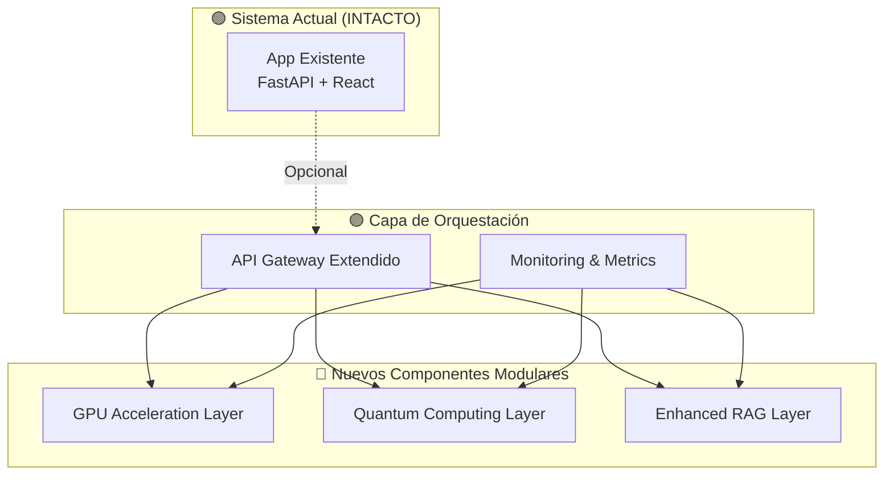
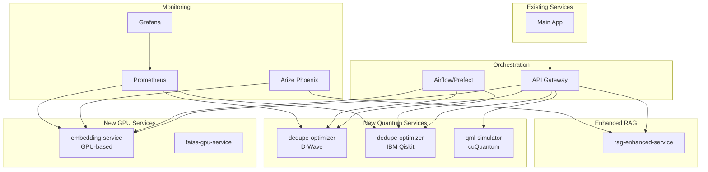

# 🚀 PLAN DE MEJORA INTEGRAL - COMPUTACIÓN CUÁNTICA Y ACELERACIÓN GPU

**Sistema Corporativo Documental con Capacidades de IA**  
**Versión:** 2.0 - Quantum & GPU Enhanced  
**Fecha:** Octubre 2025  
**Estado:** 📋 Planificación

---

## 🎯 1. OBJETIVO GENERAL

Mejorar el sistema actual de gestión documental con IA generativa mediante la integración de **computación cuántica** y **aceleración GPU NVIDIA RTX**, enfocándose en:

✅ **Reducción del esfuerzo manual** en deduplicación y clasificación documental  
✅ **Optimización del flujo** de revisión y priorización de documentos  
✅ **Incremento de precisión semántica** en búsquedas y respuestas  
✅ **Experimentación cuántica** para optimización combinatoria y aprendizaje híbrido

### ⚠️ PRIORIDAD MÁXIMA

**NO ROMPER NADA EN LA APP ACTUAL** - Todos los nuevos componentes serán **modulares, opcionales y no invasivos**.

---

## 🏗️ 2. ARQUITECTURA DE INTEGRACIÓN

### Principios de Diseño



### Estrategia de Integración

1. **Componentes independientes** con APIs REST propias
2. **Feature flags** para activar/desactivar funcionalidades
3. **Fallback automático** al sistema actual si falla componente nuevo
4. **Despliegue gradual** por fases
5. **Monitoreo exhaustivo** de performance y errores

---

## 🔧 3. EJES TECNOLÓGICOS DE MEJORA

### A. 🎮 Optimización GPU (NVIDIA RTX 4070)

**Objetivo:** Acelerar operaciones vectoriales y embeddings mediante GPU

#### Componente: `gpu-embedding-service`

**Características:**
- Servicio independiente en contenedor Docker
- API REST para generación de embeddings
- Compatible con el sistema actual (fallback a CPU)
- Monitoreo de VRAM y latencia

**Stack Tecnológico:**
```yaml
Framework: FastAPI
GPU Libraries:
  - torch (CUDA 12.1+)
  - sentence-transformers
  - faiss-gpu
  - cupy
Modelos:
  - sentence-transformers/all-MiniLM-L6-v2
  - sentence-transformers/paraphrase-multilingual-mpnet-base-v2
  - intfloat/e5-small-v2
```

**Endpoints:**
```
POST /api/gpu/embeddings/generate
POST /api/gpu/embeddings/batch
POST /api/gpu/similarity/search
GET  /api/gpu/health
GET  /api/gpu/metrics
```

**Mejoras Esperadas:**
- ⚡ Reducción tiempo de indexado: **> 80%**
- 📈 Throughput de ingestión: **3-5x más rápido**
- 💾 Uso eficiente de VRAM con batch dinámico

---

### B. ⚛️ Computación Cuántica - Optimización Combinatoria

**Objetivo:** Resolver deduplicación y clustering como problemas QUBO

#### Componente 1: `quantum-dedupe-dwave`

**Framework:** D-Wave Ocean SDK

**Características:**
- Formulación QUBO para deduplicación
- Simulated Annealing local
- Opción de migración a D-Wave real vía API

**Stack Tecnológico:**
```yaml
Framework: dwave-ocean-sdk
Libraries:
  - dimod
  - neal (simulated annealing)
  - dwave-system
  - networkx
```

#### Componente 2: `quantum-dedupe-ibm`

**Framework:** IBM Qiskit

**Características:**
- Algoritmos QAOA para optimización
- Simulador local Aer
- Opción de ejecución en IBM Quantum

**Stack Tecnológico:**
```yaml
Framework: qiskit
Libraries:
  - qiskit-optimization
  - qiskit-algorithms
  - qiskit-aer (simulador)
```

**Endpoints Comunes:**
```
POST /api/quantum/dedupe/analyze
POST /api/quantum/dedupe/optimize
POST /api/quantum/cluster/optimize
GET  /api/quantum/metrics
GET  /api/quantum/compare
```

**Mejoras Esperadas:**
- 🎯 Mayor coherencia en detección de duplicados
- 📊 +15% F1-score vs baseline clásico
- 🔍 Reducción 20-30% en revisión manual

---

### C. 🧠 Quantum Machine Learning (QML)

**Objetivo:** Kernels cuánticos para clasificación y segmentación

#### Componente 1: `qml-classifier-ibm`

**Framework:** IBM Qiskit Machine Learning

**Características:**
- Quantum kernels para SVM
- Circuitos variacionales (VQC)
- Comparación con clasificadores clásicos

#### Componente 2: `qml-classifier-dwave`

**Framework:** D-Wave Hybrid Solvers

**Características:**
- Quantum annealing para feature selection
- Hybrid classical-quantum workflows

#### Componente 3: `qml-simulator-nvidia`

**Framework:** NVIDIA cuQuantum SDK

**Características:**
- Simulación acelerada por GPU
- Soporte hasta ~30 qubits
- cuStateVec + cuTensorNet

**Stack Tecnológico:**
```yaml
NVIDIA cuQuantum:
  - custatevec
  - cutensornet
IBM Qiskit:
  - qiskit-machine-learning
  - qiskit-algorithms
D-Wave:
  - dwave-hybrid
  - dwave-preprocessing
```

**Endpoints:**
```
POST /api/qml/train
POST /api/qml/predict
POST /api/qml/evaluate
GET  /api/qml/compare-frameworks
GET  /api/qml/performance
```

**Mejoras Esperadas:**
- 🎯 Mejora precisión en clasificación
- 🛡️ Mayor resiliencia frente a ruido semántico
- 📊 Ventajas en datasets con alta correlación

---

### D. 🔄 Integración Híbrida y Orquestación DevOps

**Objetivo:** Incorporar capacidades sin alterar flujo base

#### Arquitectura de Microservicios



#### Contenedorización

**Nuevos Dockerfiles:**
- `Dockerfile.gpu-embedding`
- `Dockerfile.quantum-dwave`
- `Dockerfile.quantum-ibm`
- `Dockerfile.quantum-nvidia`
- `Dockerfile.rag-enhanced`

**Docker Compose Extendido:**
```yaml
# docker-compose.quantum-gpu.yml
version: '3.8'
services:
  # Servicios existentes (sin cambios)
  
  gpu-embedding-service:
    build: ./services/gpu-embedding
    runtime: nvidia
    environment:
      - NVIDIA_VISIBLE_DEVICES=all
    deploy:
      resources:
        reservations:
          devices:
            - driver: nvidia
              count: 1
              capabilities: [gpu]
  
  quantum-dwave-service:
    build: ./services/quantum-dwave
    environment:
      - DWAVE_API_TOKEN=${DWAVE_API_TOKEN}
  
  quantum-ibm-service:
    build: ./services/quantum-ibm
    environment:
      - QISKIT_IBM_TOKEN=${QISKIT_IBM_TOKEN}
  
  quantum-nvidia-service:
    build: ./services/quantum-nvidia
    runtime: nvidia
```

---

### E. 🤖 IA Generativa - RAG Optimizado

**Objetivo:** Mejorar interacción y recuperación con LLMs

#### Componente: `rag-enhanced-service`

**Características:**
- RAG con embeddings GPU
- FAISS-GPU o Milvus para vectores
- LLMs open-source o API
- Optimización QUBO para context relevance

**Stack Tecnológico:**
```yaml
Framework: LangChain / LlamaIndex
LLMs:
  - OpenAI GPT-4/GPT-4o (API)
  - Anthropic Claude (API)
  - Google Gemini (API)
  - Llama 3 (local)
  - Mistral 7B (local)
Vector DB:
  - FAISS-GPU
  - Milvus
  - Weaviate
```

**Endpoints:**
```
POST /api/rag/query
POST /api/rag/generate
POST /api/rag/context-optimize
GET  /api/rag/sources
GET  /api/rag/metrics
```

**Mejoras Esperadas:**
- 🎯 Mayor relevancia contextual
- 📚 100% trazabilidad de fuentes
- ⚡ Respuestas más rápidas con GPU

---

### F. 📊 Pipeline de Evaluación y Mejora Continua

**Objetivo:** Trazabilidad y mejora iterativa

#### Métricas Clave

**Performance:**
```yaml
Ingestión:
  - Tiempo medio por documento (ms)
  - Throughput (docs/segundo)
  - Uso de GPU (VRAM %)
  
Deduplicación:
  - Precision / Recall / F1
  - Tiempo de clustering (segundos)
  - Reducción revisión manual (%)
  
Clasificación:
  - Accuracy / F1-score
  - Latencia de inferencia (ms)
  - Comparación clásico vs cuántico
  
Búsqueda:
  - Latencia promedio (ms)
  - Relevancia (NDCG, MRR)
  - Throughput (queries/segundo)
  
RAG:
  - Latencia generación (ms)
  - Relevancia contextual
  - Trazabilidad fuentes (%)
```

#### Dashboard Comparativo

**Prometheus + Grafana:**
- Métricas en tiempo real
- Comparación baseline vs quantum
- Alertas automáticas
- Reportes semanales

**Arize Phoenix:**
- Observabilidad de LLMs
- Trazas de prompts
- Análisis de tokens
- Detección de drift

---

## 📦 4. STACK DE DEPENDENCIAS

### Python Base
```txt
python>=3.10
```

### IA y Optimización
```txt
# Deep Learning
torch>=2.1.0
torchvision>=0.16.0
torchaudio>=2.1.0

# Transformers & Embeddings
sentence-transformers>=2.2.2
transformers>=4.35.0

# Vector Search
faiss-gpu>=1.7.4
milvus>=2.3.0

# Quantum Computing
qiskit>=0.45.0
qiskit-machine-learning>=0.7.0
qiskit-optimization>=0.6.0
qiskit-aer>=0.13.0
dwave-ocean-sdk>=6.7.0
dimod>=0.12.0
neal>=0.6.0

# Scientific Computing
numpy>=1.24.0
pandas>=2.0.0
scikit-learn>=1.3.0
networkx>=3.0
```

### GPU & Quantum Simulation
```txt
# NVIDIA
cupy-cuda12x>=12.0.0
nvidia-cuda-runtime-cu12>=12.1.0
nvidia-cudnn-cu12>=8.9.0

# cuQuantum (instalación manual)
# https://developer.nvidia.com/cuquantum-downloads
```

### Infraestructura
```txt
# API Framework
fastapi>=0.104.0
uvicorn[standard]>=0.24.0
pydantic>=2.4.0

# Orchestration
apache-airflow>=2.7.0
prefect>=2.14.0

# Monitoring
prometheus-client>=0.18.0
arize-phoenix>=3.0.0

# RAG & LLM
langchain>=0.1.0
llama-index>=0.9.0
openai>=1.3.0
anthropic>=0.7.0
```

### DevOps
```txt
# Containerization
docker>=24.0.0
docker-compose>=2.20.0

# Testing
pytest>=7.4.0
pytest-asyncio>=0.21.0
locust>=2.17.0
```

---

## 🗓️ 5. FASES DE DESPLIEGUE

### Fase 1: GPU Acceleration (4 semanas)

**Objetivo:** Acelerar embeddings y FAISS

**Tareas:**
1. ✅ Configurar entorno CUDA/cuDNN
2. ✅ Desarrollar `gpu-embedding-service`
3. ✅ Integrar FAISS-GPU
4. ✅ Crear endpoints API
5. ✅ Benchmark baseline vs GPU
6. ✅ Dockerizar servicio
7. ✅ Integrar con app principal (feature flag)
8. ✅ Monitoreo y métricas

**Entregables:**
- Servicio GPU funcional
- Reducción > 80% tiempo indexado
- Dashboard de métricas

**Métricas de Éxito:**
- Throughput: 3-5x mejora
- Latencia: < 100ms por documento
- VRAM usage: < 8GB

---

### Fase 2: QUBO Deduplication POC (3 semanas)

**Objetivo:** Deduplicación híbrida clásica/cuántica

**Tareas:**
1. ✅ Modelar problema como QUBO
2. ✅ Implementar solver D-Wave
3. ✅ Implementar solver IBM Qiskit
4. ✅ Crear `dedupe-optimizer` service
5. ✅ Benchmark vs baseline clásico
6. ✅ Dockerizar servicios
7. ✅ Integrar con pipeline
8. ✅ Dashboard comparativo

**Entregables:**
- 2 servicios quantum (D-Wave + IBM)
- Formulación QUBO documentada
- Comparación de resultados

**Métricas de Éxito:**
- F1-score: +15% vs baseline
- Reducción revisión manual: 20-30%
- Tiempo ejecución: < 5 min

---

### Fase 3: Quantum Kernel ML (4 semanas)

**Objetivo:** Clasificación cuántica en simulador GPU

**Tareas:**
1. ✅ Implementar quantum kernels (Qiskit)
2. ✅ Implementar hybrid solver (D-Wave)
3. ✅ Integrar cuQuantum (NVIDIA)
4. ✅ Entrenar modelos comparativos
5. ✅ Crear `qml-classifier` services
6. ✅ Benchmark en datasets reales
7. ✅ Dashboard de comparación
8. ✅ Documentar resultados

**Entregables:**
- 3 servicios QML (IBM, D-Wave, NVIDIA)
- Modelos entrenados
- Análisis comparativo

**Métricas de Éxito:**
- Precisión ≥ modelo clásico
- Ventaja en datasets difíciles
- Simulación hasta 30 qubits

---

### Fase 4: Integración DevOps (2 semanas)

**Objetivo:** Microservicios dockerizados y orquestados

**Tareas:**
1. ✅ Crear docker-compose extendido
2. ✅ Configurar NVIDIA Container Toolkit
3. ✅ Implementar API Gateway
4. ✅ Configurar Airflow/Prefect
5. ✅ Integrar Prometheus + Grafana
6. ✅ Configurar autoscaling
7. ✅ Testing end-to-end
8. ✅ Documentación deployment

**Entregables:**
- Pipeline completo dockerizado
- Orquestación activa
- Monitoreo en tiempo real

**Métricas de Éxito:**
- Autoscaling funcional
- Logging centralizado
- Uptime > 99%

---

### Fase 5: Generative Layer (3 semanas)

**Objetivo:** RAG con contexto optimizado

**Tareas:**
1. ✅ Integrar LLMs (OpenAI/local)
2. ✅ Implementar RAG con FAISS-GPU
3. ✅ Optimizar context selection (QUBO)
4. ✅ Crear `rag-enhanced-service`
5. ✅ Implementar chain-of-thought
6. ✅ Auditoría de fuentes
7. ✅ Testing de calidad
8. ✅ Integración con Phoenix

**Entregables:**
- Servicio RAG optimizado
- API unificada
- Trazabilidad 100%

**Métricas de Éxito:**
- Relevancia contextual > 90%
- Respuestas trazables 100%
- Latencia < 2s

---

### Fase 6: Evaluación Continua (Ongoing)

**Objetivo:** Reporting y benchmarks

**Tareas:**
1. ✅ Dashboard Prometheus/Grafana
2. ✅ Reportes automáticos semanales
3. ✅ Dataset sintético para benchmarks
4. ✅ CI/CD con validación automática
5. ✅ A/B testing framework
6. ✅ Documentación de mejoras

**Entregables:**
- Dashboard completo
- Reportes automáticos
- Mejora sostenida

**Métricas de Éxito:**
- Mejora sostenida > 10%
- Reportes semanales
- Zero downtime

---

## 📈 6. BENEFICIOS TÉCNICOS ESPERADOS

### Performance
- ⚡ **Ingestión documental:** 3-5× más rápida
- 🚀 **Indexado:** > 80% reducción de tiempo
- 📊 **Throughput:** 3-5× aumento

### Precisión
- 🎯 **Deduplicación:** +15% F1-score
- 🧠 **Clasificación:** Mayor precisión en casos difíciles
- 🔍 **Búsqueda:** Mayor relevancia semántica

### Eficiencia Operativa
- 📉 **Revisión manual:** -20-30% carga
- ✅ **Coherencia:** Mayor consistencia en clustering
- 🤖 **Automatización:** Más tareas sin intervención humana

### Capacidades Avanzadas
- ⚛️ **Investigación cuántica:** Sin hardware externo
- 🏗️ **Arquitectura modular:** Fácil extensión
- 📊 **Trazabilidad:** 100% auditable

---

## 🚀 7. PRÓXIMOS PASOS INMEDIATOS

### Semana 1-2: Preparación

- [ ] Confirmar entorno CUDA/cuQuantum operativo
- [ ] Verificar driver NVIDIA + toolkit
- [ ] Actualizar dependencias en entorno virtual
- [ ] Crear estructura de carpetas para nuevos servicios
- [ ] Configurar repositorios Git para cada componente

### Semana 3-4: Baseline

- [ ] Correr benchmark baseline (embeddings CPU)
- [ ] Medir tiempo de indexado actual
- [ ] Documentar métricas de deduplicación actual
- [ ] Preparar dataset reducido para pruebas
- [ ] Establecer métricas objetivo

### Semana 5-6: Primer Componente

- [ ] Desarrollar `gpu-embedding-service`
- [ ] Integrar FAISS-GPU
- [ ] Crear endpoints API
- [ ] Dockerizar servicio
- [ ] Medir mejoras vs baseline

### Semana 7-8: Integración

- [ ] Integrar con app principal (feature flag)
- [ ] Configurar monitoreo
- [ ] Testing end-to-end
- [ ] Documentar resultados
- [ ] Preparar demo para stakeholders

---

## 📋 8. ESTRUCTURA DE CARPETAS PROPUESTA

```
Sistema-Corporativo-Documental-con-Capacidades-de-IA/
├── backend/                          # Backend existente (SIN CAMBIOS)
├── frontend/                         # Frontend existente (SIN CAMBIOS)
├── services/                         # NUEVOS SERVICIOS
│   ├── gpu-embedding/
│   │   ├── Dockerfile
│   │   ├── requirements.txt
│   │   ├── main.py
│   │   ├── api/
│   │   ├── models/
│   │   └── tests/
│   ├── quantum-dwave/
│   │   ├── Dockerfile
│   │   ├── requirements.txt
│   │   ├── main.py
│   │   ├── solvers/
│   │   └── tests/
│   ├── quantum-ibm/
│   │   ├── Dockerfile
│   │   ├── requirements.txt
│   │   ├── main.py
│   │   ├── circuits/
│   │   └── tests/
│   ├── quantum-nvidia/
│   │   ├── Dockerfile
│   │   ├── requirements.txt
│   │   ├── main.py
│   │   ├── simulators/
│   │   └── tests/
│   └── rag-enhanced/
│       ├── Dockerfile
│       ├── requirements.txt
│       ├── main.py
│       ├── chains/
│       └── tests/
├── orchestration/                    # ORQUESTACIÓN
│   ├── airflow/
│   │   └── dags/
│   └── prefect/
│       └── flows/
├── monitoring/                       # MONITOREO
│   ├── prometheus/
│   │   └── prometheus.yml
│   ├── grafana/
│   │   └── dashboards/
│   └── phoenix/
│       └── config/
├── docker-compose.quantum-gpu.yml   # NUEVO COMPOSE
├── docs/
│   ├── QUANTUM_GPU_ENHANCEMENT_PLAN.md  # ESTE DOCUMENTO
│   ├── QUANTUM_SETUP_GUIDE.md
│   ├── GPU_OPTIMIZATION_GUIDE.md
│   └── BENCHMARKS.md
└── benchmarks/                       # BENCHMARKS
    ├── baseline/
    ├── gpu/
    ├── quantum/
    └── reports/
```

---

## 🔒 9. CONSIDERACIONES DE SEGURIDAD

### API Keys y Secrets

```yaml
# .env.quantum
DWAVE_API_TOKEN=your_dwave_token
QISKIT_IBM_TOKEN=your_ibm_token
OPENAI_API_KEY=your_openai_key
ANTHROPIC_API_KEY=your_anthropic_key
GOOGLE_API_KEY=your_google_key
```

### Network Security

- Todos los servicios en red privada Docker
- API Gateway como único punto de entrada
- Rate limiting en todos los endpoints
- Autenticación JWT heredada del sistema actual

### Data Privacy

- Embeddings procesados en local (GPU)
- Opción de LLMs locales (Llama 3, Mistral)
- Logs anonimizados
- Cumplimiento GDPR mantenido

---

## 📊 10. MÉTRICAS DE ÉXITO DEL PROYECTO

### KPIs Técnicos

| Métrica | Baseline | Objetivo | Medición |
|---------|----------|----------|----------|
| Tiempo indexado | 100% | < 20% | ms/documento |
| Throughput ingestión | 1x | 3-5x | docs/segundo |
| F1 deduplicación | X% | X+15% | Precision/Recall |
| Latencia búsqueda | Y ms | < Y/2 ms | p95 latency |
| Relevancia RAG | Z% | > 90% | User feedback |
| Revisión manual | 100% | 70-80% | horas/semana |

### KPIs de Negocio

- 💰 Reducción de costes operativos
- ⏱️ Tiempo de respuesta a usuarios
- 😊 Satisfacción de usuarios
- 📈 Adopción de nuevas funcionalidades
- 🎯 Precisión en clasificación

---

## 📞 11. CONTACTO Y SOPORTE

**Equipo de Desarrollo:**
- Tech Lead: [Nombre]
- Quantum Computing: [Nombre]
- GPU Optimization: [Nombre]
- DevOps: [Nombre]

**Recursos:**
- 📚 Documentación: `docs/`
- 🐛 Issues: GitHub Issues
- 💬 Slack: #quantum-gpu-project

---

## 📝 12. CHANGELOG

### v2.0.0 - Plan Inicial (Octubre 2025)
- ✅ Documento de plan creado
- ✅ Arquitectura diseñada
- ✅ Fases definidas
- 📋 Pendiente: Implementación

---

**© 2025 TeFinancia S.A. - FinancIA 2030 Team**  
**Confidencial - Uso Interno**
