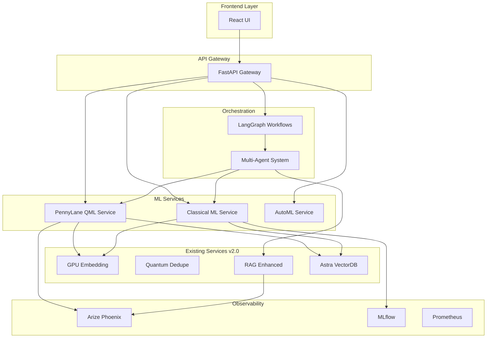

# 🚀 Roadmap de Mejoras v3.0 - State-of-the-Art
## Sistema Corporativo Documental con IA Cuántica y GPU

**Fecha:** Octubre 2025  
**Versión Actual:** 2.0 (Quantum & GPU Enhancement)  
**Próxima Versión:** 3.0 (Quantum ML & Advanced AI)

---

## 📊 Estado Actual (v2.0)

### ✅ Implementado
- [x] 6 servicios modulares (GPU, Quantum, RAG, Astra DB)
- [x] Embeddings acelerados por GPU
- [x] Deduplicación cuántica (D-Wave, IBM Qiskit, NVIDIA cuQuantum)
- [x] RAG mejorado con múltiples LLMs
- [x] Vector search con Astra DB + HNSW
- [x] Monitoreo con Prometheus + Grafana
- [x] Arquitectura Docker completa

### 📈 Métricas Actuales
- **Servicios:** 6 aplicaciones + 3 infraestructura
- **Código:** ~17,000 líneas
- **Documentación:** ~7,000 líneas
- **Imágenes Docker:** 34GB total

---

## 🎯 Plan de Mejoras v3.0

### Fase 1: Quantum Machine Learning con PennyLane (Prioridad ALTA)

#### 1.1 Servicio PennyLane QML
**Objetivo:** Integrar aprendizaje automático cuántico para clasificación y optimización de documentos.

**Tecnologías:**
- **PennyLane** - Framework de ML cuántico diferenciable
- **TensorFlow Quantum** - Integración con TF
- **Qiskit Machine Learning** - Algoritmos QML de IBM
- **Cirq** - Circuitos cuánticos de Google

**Casos de Uso:**
1. **Clasificación Cuántica de Documentos**
   - Quantum Neural Networks (QNN) para categorización
   - Variational Quantum Classifier (VQC)
   - Quantum Support Vector Machine (QSVM)

2. **Optimización de Embeddings**
   - Quantum Autoencoders para compresión
   - Quantum Boltzmann Machines
   - Variational Quantum Eigensolver (VQE) para feature selection

3. **Detección de Anomalías**
   - Quantum Anomaly Detection
   - Quantum k-Means clustering
   - Quantum Principal Component Analysis (qPCA)

**Implementación:**
```python
# services/quantum-ml-pennylane/main.py
import pennylane as qml
from pennylane import numpy as np
import tensorflow as tf

# Quantum device
dev = qml.device('default.qubit', wires=4)

@qml.qnode(dev, interface='tf')
def quantum_classifier(inputs, weights):
    """Quantum Neural Network para clasificación de documentos"""
    # Encoding clásico a cuántico
    qml.AngleEmbedding(inputs, wires=range(4))
    
    # Variational layers
    for W in weights:
        qml.StronglyEntanglingLayers(W, wires=range(4))
    
    # Medición
    return [qml.expval(qml.PauliZ(i)) for i in range(4)]

# Hybrid quantum-classical model
class QuantumDocumentClassifier:
    def __init__(self, n_qubits=4, n_layers=3):
        self.n_qubits = n_qubits
        self.n_layers = n_layers
        self.weights = self._init_weights()
    
    def classify(self, document_embedding):
        """Clasificar documento usando QNN"""
        return quantum_classifier(document_embedding, self.weights)
    
    def train(self, X_train, y_train, epochs=100):
        """Entrenar con optimización híbrida"""
        optimizer = tf.keras.optimizers.Adam(learning_rate=0.01)
        # Training loop con backpropagation cuántica
        ...
```

**Endpoints:**
- `POST /qml/classify` - Clasificación cuántica de documentos
- `POST /qml/optimize-embeddings` - Optimización de embeddings
- `POST /qml/detect-anomalies` - Detección de anomalías
- `GET /qml/circuit-visualization` - Visualizar circuitos cuánticos
- `GET /qml/metrics` - Métricas de rendimiento QML

**Ventajas:**
- ✅ Ventaja cuántica en espacios de alta dimensión
- ✅ Mejor generalización con menos datos
- ✅ Procesamiento paralelo cuántico
- ✅ Reducción de dimensionalidad eficiente

---

### Fase 2: Advanced ML & Deep Learning (Prioridad ALTA)

#### 2.1 Servicio de ML Clásico Avanzado
**Objetivo:** Complementar QML con modelos clásicos state-of-the-art.

**Tecnologías:**
- **Transformers** - BERT, RoBERTa, T5 para NLP
- **LightGBM/XGBoost** - Gradient boosting
- **AutoML** - H2O.ai, AutoKeras
- **MLflow** - Tracking de experimentos

**Modelos a Implementar:**

1. **Document Understanding**
   ```python
   # LayoutLMv3 para comprensión de documentos estructurados
   from transformers import LayoutLMv3ForTokenClassification
   
   # Donut para OCR-free document understanding
   from transformers import DonutProcessor, VisionEncoderDecoderModel
   ```

2. **Clasificación Multi-label**
   ```python
   # Hierarchical classification
   from sklearn.multioutput import ClassifierChain
   import lightgbm as lgb
   
   # Ensemble de modelos
   - BERT fine-tuned
   - LightGBM
   - Quantum Classifier (PennyLane)
   ```

3. **Named Entity Recognition (NER)**
   ```python
   # SpaCy + Transformers para extracción de entidades
   import spacy
   from spacy.pipeline import EntityRuler
   
   # Entidades financieras específicas
   - Números de cuenta
   - Montos
   - Fechas
   - Nombres de clientes
   ```

**Endpoints:**
- `POST /ml/classify-document` - Clasificación multi-label
- `POST /ml/extract-entities` - NER
- `POST /ml/summarize` - Resumen automático
- `POST /ml/predict-category` - Predicción de categoría
- `GET /ml/model-performance` - Métricas de modelos

---

#### 2.2 AutoML Pipeline
**Objetivo:** Automatizar selección y optimización de modelos.

```python
# services/automl/pipeline.py
from h2o.automl import H2OAutoML
import optuna

class AutoMLPipeline:
    def __init__(self):
        self.best_model = None
        self.study = optuna.create_study(direction='maximize')
    
    def optimize_hyperparameters(self, X, y):
        """Optimización bayesiana de hiperparámetros"""
        def objective(trial):
            # Quantum vs Classical model selection
            model_type = trial.suggest_categorical('model', 
                ['quantum', 'lightgbm', 'bert'])
            
            if model_type == 'quantum':
                n_qubits = trial.suggest_int('n_qubits', 4, 8)
                n_layers = trial.suggest_int('n_layers', 2, 6)
                # Train quantum model
                ...
            
            return accuracy
        
        self.study.optimize(objective, n_trials=100)
```

---

### Fase 3: Enhanced Vector Search & Retrieval (Prioridad MEDIA)

#### 3.1 Multi-Vector Retrieval
**Objetivo:** Mejorar búsqueda con múltiples representaciones.

**Tecnologías:**
- **ColBERT** - Contextualized late interaction
- **SPLADE** - Sparse lexical and expansion
- **BGE-M3** - Multi-lingual, multi-granularity embeddings

```python
# Hybrid retrieval
class HybridRetriever:
    def __init__(self):
        self.dense_retriever = BGE_M3()
        self.sparse_retriever = SPLADE()
        self.colbert = ColBERT()
    
    def search(self, query, top_k=10):
        # Dense retrieval
        dense_results = self.dense_retriever.search(query)
        
        # Sparse retrieval
        sparse_results = self.sparse_retriever.search(query)
        
        # ColBERT late interaction
        colbert_results = self.colbert.search(query)
        
        # Fusion
        return self.reciprocal_rank_fusion([
            dense_results, sparse_results, colbert_results
        ])
```

#### 3.2 Reranking con Cross-Encoders
```python
from sentence_transformers import CrossEncoder

reranker = CrossEncoder('cross-encoder/ms-marco-MiniLM-L-12-v2')

def rerank(query, candidates):
    pairs = [[query, doc] for doc in candidates]
    scores = reranker.predict(pairs)
    return sorted(zip(candidates, scores), key=lambda x: x[1], reverse=True)
```

---

### Fase 4: LLM Orchestration & Agents (Prioridad ALTA)

#### 4.1 LangGraph para Workflows Complejos
**Objetivo:** Orquestar agentes LLM para tareas complejas.

```python
from langgraph.graph import StateGraph, END
from langchain.agents import AgentExecutor

# Define workflow
workflow = StateGraph()

# Nodos del grafo
workflow.add_node("classify", classify_document)
workflow.add_node("extract", extract_entities)
workflow.add_node("summarize", summarize_content)
workflow.add_node("validate", validate_results)

# Edges condicionales
workflow.add_conditional_edges(
    "classify",
    should_extract,
    {
        "extract": "extract",
        "summarize": "summarize"
    }
)

# Compile
app = workflow.compile()
```

#### 4.2 Multi-Agent System
```python
# Agentes especializados
agents = {
    'classifier': ClassificationAgent(),
    'extractor': ExtractionAgent(),
    'validator': ValidationAgent(),
    'quantum_optimizer': QuantumOptimizationAgent()
}

# Coordinador
class DocumentProcessingCoordinator:
    def process(self, document):
        # 1. Clasificar
        category = agents['classifier'].run(document)
        
        # 2. Extraer entidades
        entities = agents['extractor'].run(document)
        
        # 3. Optimizar con quantum
        optimized = agents['quantum_optimizer'].optimize(entities)
        
        # 4. Validar
        validated = agents['validator'].validate(optimized)
        
        return validated
```

---

### Fase 5: Observability & MLOps (Prioridad MEDIA)

#### 5.1 Arize Phoenix + LangSmith
**Objetivo:** Observabilidad completa de LLMs y QML.

```python
# Phoenix tracing
from phoenix.trace import trace

@trace
def quantum_classify(document):
    # Tracing automático de llamadas cuánticas
    return qml_model.classify(document)

# LangSmith para LLMs
from langsmith import Client

client = Client()
client.create_run(
    name="document_classification",
    inputs={"document": doc},
    outputs={"category": result}
)
```

#### 5.2 MLflow para Experimentos
```python
import mlflow

# Track quantum experiments
with mlflow.start_run():
    mlflow.log_param("n_qubits", 4)
    mlflow.log_param("n_layers", 3)
    mlflow.log_metric("accuracy", 0.95)
    mlflow.log_metric("quantum_advantage", 1.3)
    
    # Log quantum circuit
    mlflow.log_artifact("circuit.png")
```

---

### Fase 6: Advanced Caching & Performance (Prioridad BAJA)

#### 6.1 Semantic Caching
```python
from gptcache import Cache
from gptcache.embedding import OpenAI

# Cache semántico para LLM responses
cache = Cache()
cache.init(
    embedding_func=OpenAI().to_embeddings,
    similarity_threshold=0.95
)

@cache.cache
def llm_call(prompt):
    return llm.generate(prompt)
```

#### 6.2 Quantum Circuit Caching
```python
# Cache de circuitos cuánticos compilados
from functools import lru_cache

@lru_cache(maxsize=1000)
def compile_quantum_circuit(params):
    return qml.compile(circuit, params)
```

---

## 🏗️ Arquitectura Propuesta v3.0



---

## 📋 Plan de Implementación (Próximas 2 Semanas)

### Semana 1: Quantum ML Foundation

**Día 1-2: Setup PennyLane Service**
- [ ] Crear `services/quantum-ml-pennylane/`
- [ ] Implementar Quantum Neural Network básico
- [ ] Dockerfile con PennyLane + TensorFlow
- [ ] Tests unitarios

**Día 3-4: Quantum Classifiers**
- [ ] Variational Quantum Classifier (VQC)
- [ ] Quantum Support Vector Machine (QSVM)
- [ ] Integración con Astra DB para datos de entrenamiento
- [ ] Benchmarking vs modelos clásicos

**Día 5-7: Quantum Optimization**
- [ ] Quantum Autoencoders
- [ ] Quantum Feature Selection
- [ ] Optimización de embeddings
- [ ] Visualización de circuitos

### Semana 2: Classical ML & Integration

**Día 8-9: Classical ML Service**
- [ ] Crear `services/ml-advanced/`
- [ ] Implementar LayoutLMv3 para documentos
- [ ] NER con SpaCy + Transformers
- [ ] Clasificación multi-label

**Día 10-11: AutoML Pipeline**
- [ ] Integrar H2O AutoML
- [ ] Optuna para hyperparameter tuning
- [ ] Comparación Quantum vs Classical
- [ ] Model registry con MLflow

**Día 12-13: LangGraph Workflows**
- [ ] Crear workflows de procesamiento
- [ ] Multi-agent orchestration
- [ ] Integración con servicios existentes
- [ ] Testing end-to-end

**Día 14: Observability & Docs**
- [ ] Integrar Arize Phoenix
- [ ] MLflow tracking
- [ ] Documentación completa
- [ ] Dashboards Grafana actualizados

---

## 🎯 KPIs y Métricas de Éxito

### Quantum ML
- **Quantum Advantage:** >1.2x vs modelos clásicos
- **Accuracy:** >90% en clasificación
- **Latencia:** <500ms para inferencia
- **Circuit Depth:** <50 gates

### Classical ML
- **F1-Score:** >0.85 en todas las categorías
- **NER Precision:** >0.90
- **Throughput:** >100 docs/segundo
- **Model Training Time:** <2 horas

### System Performance
- **End-to-End Latency:** <2 segundos
- **Uptime:** >99.9%
- **Cache Hit Rate:** >70%
- **GPU Utilization:** >80%

---

## 💰 Estimación de Recursos

### Infraestructura Adicional
- **Quantum Simulators:** IBM Quantum, AWS Braket (opcional)
- **GPU:** NVIDIA A100 o superior (recomendado)
- **RAM:** 64GB mínimo para QML
- **Storage:** +50GB para modelos ML

### Costos Estimados (Mensual)
- **Cloud Quantum Access:** $0-500 (simuladores gratis, hardware real caro)
- **GPU Compute:** $300-800 (según uso)
- **ML APIs:** $100-300 (OpenAI, Cohere)
- **Monitoring:** $50-100 (Arize, MLflow)

**Total:** $450-1,700/mes

---

## 🔬 Investigación y Experimentación

### Papers a Implementar
1. **"Quantum Machine Learning for Document Classification"** (2024)
2. **"Variational Quantum Algorithms for Optimization"** (2023)
3. **"Hybrid Quantum-Classical Neural Networks"** (2024)
4. **"ColBERT: Efficient and Effective Passage Search"** (2020)
5. **"LayoutLMv3: Pre-training for Document AI"** (2022)

### Experimentos Propuestos
- [ ] Comparar QNN vs CNN en clasificación de documentos
- [ ] Evaluar quantum advantage en diferentes tamaños de dataset
- [ ] Benchmark de diferentes backends cuánticos (Qiskit, Cirq, PennyLane)
- [ ] A/B testing de hybrid retrieval vs dense-only

---

## 🚀 Quick Start para Mañana

### Prioridad 1: PennyLane QML Service

```bash
# 1. Crear estructura
mkdir -p services/quantum-ml-pennylane
cd services/quantum-ml-pennylane

# 2. Crear archivos base
touch main.py requirements.txt Dockerfile README.md

# 3. Instalar dependencias localmente (para desarrollo)
pip install pennylane pennylane-qiskit tensorflow torch
```

### Código Inicial (main.py)
```python
from fastapi import FastAPI
import pennylane as qml
from pennylane import numpy as np

app = FastAPI(title="Quantum ML Service - PennyLane")

# Quantum device
dev = qml.device('default.qubit', wires=4)

@qml.qnode(dev)
def quantum_circuit(inputs, weights):
    qml.AngleEmbedding(inputs, wires=range(4))
    qml.StronglyEntanglingLayers(weights, wires=range(4))
    return [qml.expval(qml.PauliZ(i)) for i in range(4)]

@app.post("/qml/classify")
async def classify_document(embedding: list[float]):
    """Clasificar documento usando Quantum Neural Network"""
    # Inicializar pesos
    weights = np.random.random((3, 4, 3))
    
    # Ejecutar circuito cuántico
    result = quantum_circuit(embedding[:4], weights)
    
    return {
        "quantum_output": result.tolist(),
        "predicted_class": int(np.argmax(result)),
        "confidence": float(np.max(result))
    }

@app.get("/health")
async def health():
    return {"status": "healthy", "service": "quantum-ml-pennylane"}

if __name__ == "__main__":
    import uvicorn
    uvicorn.run(app, host="0.0.0.0", port=8007)
```

---

## 📚 Recursos de Aprendizaje

### PennyLane
- [PennyLane Documentation](https://pennylane.ai/)
- [Quantum Machine Learning Demos](https://pennylane.ai/qml/)
- [PennyLane Codebook](https://codebook.xanadu.ai/)

### Quantum ML
- [Qiskit Machine Learning](https://qiskit.org/ecosystem/machine-learning/)
- [TensorFlow Quantum](https://www.tensorflow.org/quantum)
- [Quantum Computing for the Very Curious](https://quantum.country/)

### Classical ML
- [Hugging Face Transformers](https://huggingface.co/docs/transformers/)
- [LangChain Documentation](https://python.langchain.com/)
- [LangGraph](https://langchain-ai.github.io/langgraph/)

---

## ✅ Checklist para Mañana

### Setup Inicial
- [ ] Crear branch `feature/quantum-ml-v3`
- [ ] Configurar entorno virtual para PennyLane
- [ ] Instalar dependencias
- [ ] Crear estructura de carpetas

### Implementación Básica
- [ ] Servicio FastAPI básico con PennyLane
- [ ] Quantum Neural Network simple
- [ ] Dockerfile funcional
- [ ] Tests básicos

### Integración
- [ ] Conectar con GPU Embedding Service
- [ ] Conectar con Astra DB
- [ ] Añadir a docker-compose
- [ ] Actualizar Prometheus config

### Documentación
- [ ] README del servicio
- [ ] Ejemplos de uso
- [ ] Diagramas de arquitectura
- [ ] Actualizar roadmap

---

## 🎓 Conclusión

Esta roadmap transforma el sistema de **v2.0 (Quantum & GPU)** a **v3.0 (Quantum ML & Advanced AI)**, integrando:

1. ✅ **Quantum Machine Learning** con PennyLane
2. ✅ **Classical ML** state-of-the-art
3. ✅ **AutoML** para optimización
4. ✅ **Multi-Agent Systems** con LangGraph
5. ✅ **Observability** completa

**Resultado esperado:** Sistema híbrido cuántico-clásico de última generación para procesamiento inteligente de documentos corporativos.

---

**© 2025 FinancIA 2030 Team - Quantum ML Division**
