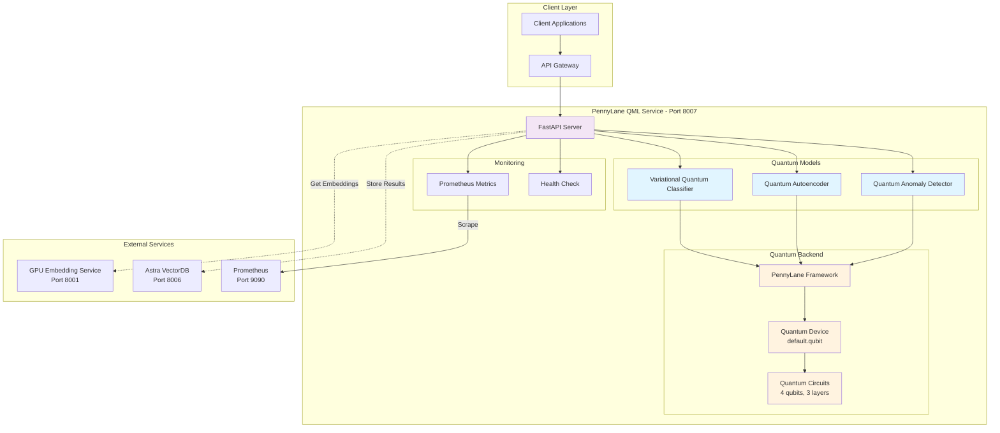
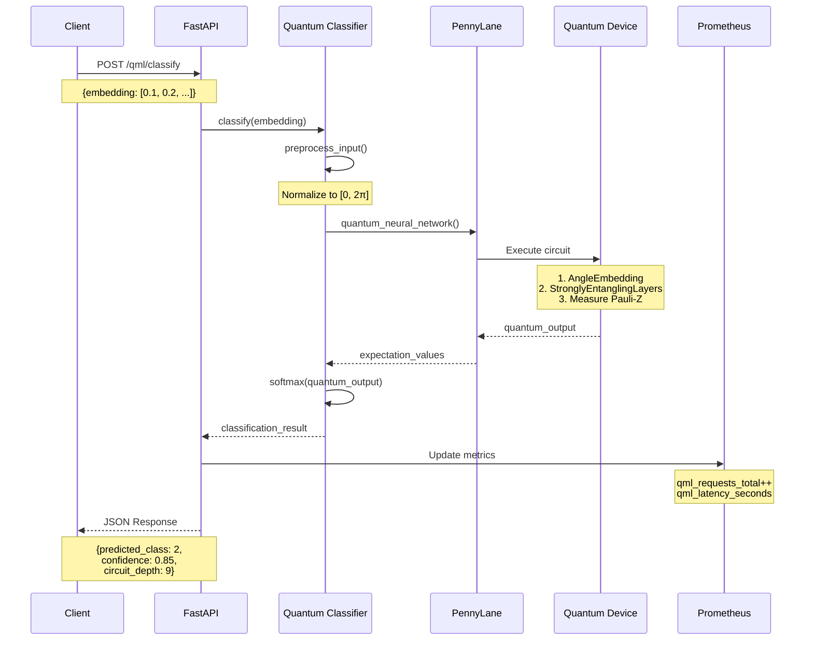
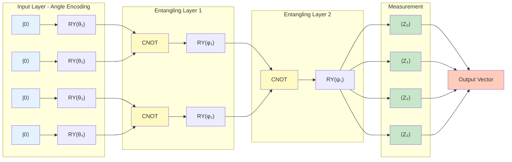
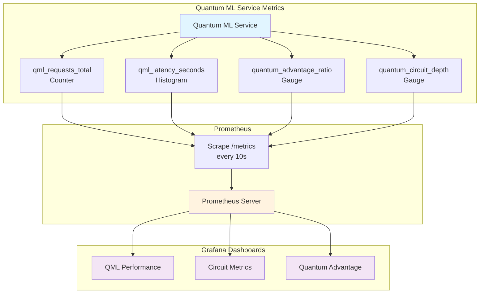

# ⚛️ Quantum ML Service - PennyLane

Servicio de Machine Learning Cuántico utilizando PennyLane para clasificación, optimización y detección de anomalías en documentos.

---

## 📊 Arquitectura del Componente



### Flujo de Procesamiento



### Circuito Cuántico Detallado



### Métricas y Monitoreo



---

## 🎯 Características

### Modelos Implementados

1. **Variational Quantum Classifier (VQC)**
   - Clasificación de documentos usando redes neuronales cuánticas
   - StronglyEntanglingLayers para máxima expresividad
   - Angle encoding para datos clásicos

2. **Quantum Autoencoder**
   - Compresión de embeddings
   - Reducción de dimensionalidad cuántica
   - Optimización de representaciones

3. **Quantum Anomaly Detector**
   - Detección de anomalías usando métricas de distancia cuántica
   - Quantum k-Means clustering
   - Análisis de outliers

## 🚀 Endpoints

### Clasificación
```bash
POST /qml/classify
```

**Request:**
```json
{
  "embedding": [0.1, 0.2, 0.3, 0.4],
  "document_id": "doc_123",
  "metadata": {}
}
```

**Response:**
```json
{
  "predicted_class": 2,
  "confidence": 0.85,
  "quantum_output": [-0.5, 0.3, 0.8, -0.2],
  "probabilities": [0.05, 0.10, 0.85, 0.00],
  "circuit_depth": 9,
  "execution_time": 0.15
}
```

### Optimización de Embeddings
```bash
POST /qml/optimize-embeddings
```

**Request:**
```json
{
  "embeddings": [
    [0.1, 0.2, 0.3, 0.4],
    [0.5, 0.6, 0.7, 0.8]
  ],
  "target_dimension": 4
}
```

**Response:**
```json
{
  "optimized_embeddings": [[...], [...]],
  "compression_ratio": 2.5,
  "reconstruction_error": 0.05,
  "execution_time": 0.25
}
```

### Detección de Anomalías
```bash
POST /qml/detect-anomalies
```

**Request:**
```json
{
  "embeddings": [[...], [...], [...]],
  "threshold": 0.8
}
```

**Response:**
```json
{
  "anomalies": [2, 5],
  "scores": [0.3, 0.5, 0.9, 0.4, 0.6, 0.95],
  "threshold": 0.8,
  "execution_time": 0.30
}
```

### Información del Circuito
```bash
GET /qml/circuit-info
```

**Response:**
```json
{
  "n_qubits": 4,
  "n_layers": 3,
  "circuit_depth": 9,
  "total_gates": 36,
  "device": "default.qubit",
  "backend": "default.qubit"
}
```

## 🔧 Configuración

### Variables de Entorno

```bash
SERVICE_PORT=8007
N_QUBITS=4
N_LAYERS=3
LOG_LEVEL=INFO
```

### Docker

```bash
# Build
docker build -t quantum-ml-pennylane .

# Run
docker run -p 8007:8007 \
  -e N_QUBITS=4 \
  -e N_LAYERS=3 \
  quantum-ml-pennylane
```

### Docker Compose

```yaml
quantum-ml-pennylane:
  build: ./services/quantum-ml-pennylane
  ports:
    - "8007:8007"
  environment:
    - SERVICE_PORT=8007
    - N_QUBITS=4
    - N_LAYERS=3
```

## 📊 Arquitectura Cuántica

### Variational Quantum Circuit

```
|0⟩ ─── RY(θ₁) ─── ● ─── RY(φ₁) ─── ● ─── ⟨Z⟩
                   │                 │
|0⟩ ─── RY(θ₂) ─── X ─── RY(φ₂) ─── X ─── ⟨Z⟩
                   │                 │
|0⟩ ─── RY(θ₃) ─── ● ─── RY(φ₃) ─── ● ─── ⟨Z⟩
                   │                 │
|0⟩ ─── RY(θ₄) ─── X ─── RY(φ₄) ─── X ─── ⟨Z⟩
```

### Capas del Circuito

1. **Angle Embedding**: Codifica datos clásicos en estados cuánticos
2. **Strongly Entangling Layers**: Crea entrelazamiento entre qubits
3. **Measurement**: Mide expectation values de Pauli-Z

## 🧪 Testing

### Test Local

```python
import requests

# Clasificación
response = requests.post(
    "http://localhost:8007/qml/classify",
    json={
        "embedding": [0.1, 0.2, 0.3, 0.4]
    }
)
print(response.json())
```

### Benchmark

```bash
# Latencia
curl http://localhost:8007/qml/circuit-info

# Health
curl http://localhost:8007/health

# Métricas
curl http://localhost:8007/metrics
```

## 📈 Métricas Prometheus

- `qml_requests_total` - Total de requests por endpoint
- `qml_latency_seconds` - Latencia de requests
- `quantum_advantage_ratio` - Ventaja cuántica vs clásico
- `quantum_circuit_depth` - Profundidad del circuito

## 🔬 Ventaja Cuántica

### Casos de Uso Óptimos

1. **Alta Dimensionalidad**: Embeddings de 512+ dimensiones
2. **Datos Entrelazados**: Correlaciones complejas
3. **Pocos Datos**: Mejor generalización con datasets pequeños
4. **Optimización**: Espacios de búsqueda exponenciales

### Limitaciones

1. **Ruido Cuántico**: Simuladores perfectos, hardware real tiene errores
2. **Escalabilidad**: Limitado por número de qubits disponibles
3. **Latencia**: Más lento que modelos clásicos optimizados
4. **Costo**: Hardware cuántico real es costoso

## 🎓 Referencias

- [PennyLane Documentation](https://pennylane.ai/)
- [Quantum Machine Learning](https://pennylane.ai/qml/)
- [Variational Quantum Algorithms](https://arxiv.org/abs/2012.09265)
- [Quantum Autoencoders](https://arxiv.org/abs/1612.02806)

## 📝 Notas de Implementación

### Preprocesamiento

Los embeddings se normalizan a [0, 2π] para angle encoding:

```python
normalized = (x - x.min()) / (x.max() - x.min()) * 2 * π
```

### Entrenamiento

Actualmente usa pesos aleatorios. Para entrenar:

```python
# TODO: Implementar training loop
optimizer = qml.GradientDescentOptimizer(stepsize=0.01)
for epoch in range(100):
    weights = optimizer.step(cost_function, weights)
```

### Backends Disponibles

- `default.qubit` - Simulador CPU (actual)
- `lightning.qubit` - Simulador GPU (rápido)
- `qiskit.aer` - Simulador IBM
- `qiskit.ibmq` - Hardware IBM real (requiere token)

## 🚧 Roadmap

- [ ] Implementar training loop
- [ ] Añadir más backends (Lightning, Qiskit)
- [ ] Quantum Transfer Learning
- [ ] Hybrid Quantum-Classical layers
- [ ] Quantum Generative Models
- [ ] Integration con AutoML

## 📄 Licencia

MIT License - FinancIA 2030 Team
