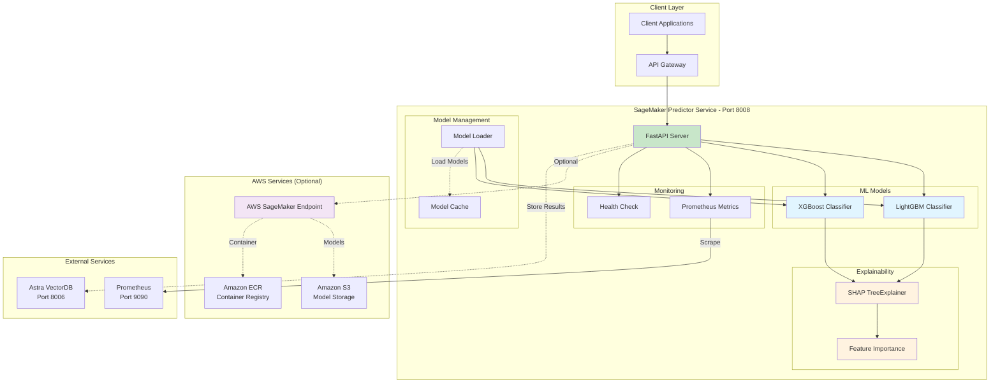
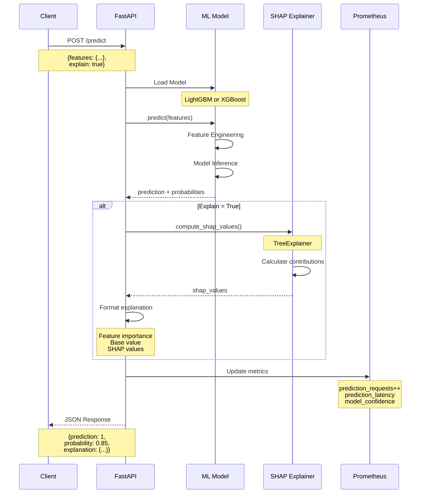
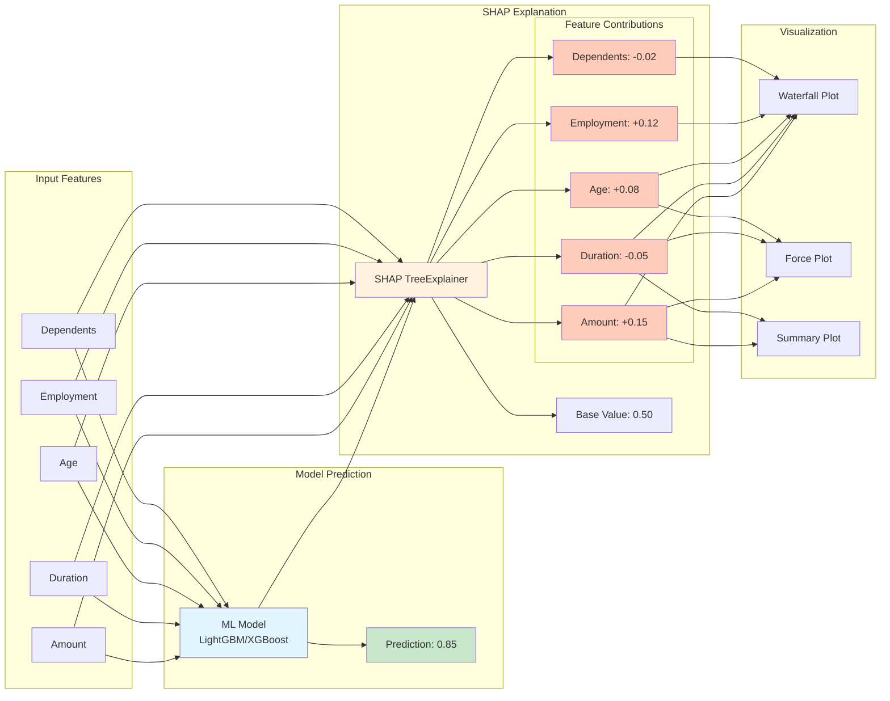
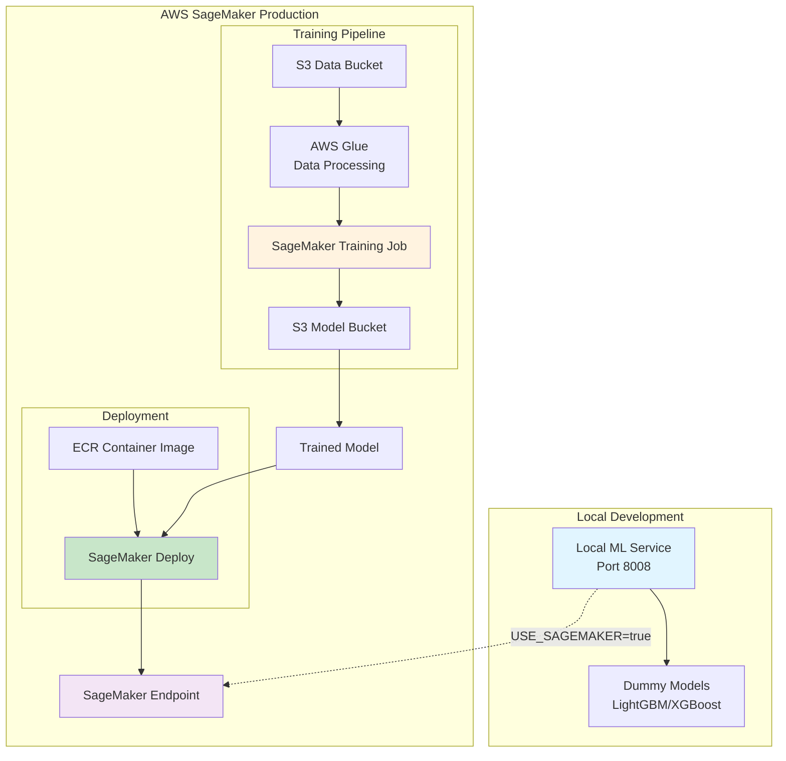

# 🤖 SageMaker Predictive ML Service

Servicio de Machine Learning predictivo con explainability (SHAP) para decisiones financieras basado en AWS SageMaker.

**Basado en:** [awslabs/sagemaker-explaining-credit-decisions](https://github.com/awslabs/sagemaker-explaining-credit-decisions)

---

## 📊 Arquitectura del Componente



### Flujo de Predicción con Explainability



### SHAP Explainability Flow



### Integration with AWS SageMaker



---

## 🎯 Características

### Modelos Implementados

1. **LightGBM Classifier**
   - Gradient boosting rápido y eficiente
   - Manejo automático de features categóricas
   - Optimizado para grandes datasets

2. **XGBoost Classifier**
   - Extreme Gradient Boosting
   - Alta precisión en clasificación
   - Regularización incorporada

### Explainability con SHAP

- **TreeExplainer**: Explicaciones rápidas para modelos tree-based
- **Feature Importance**: Contribución de cada feature
- **Waterfall Plots**: Visualización de contribuciones
- **Force Plots**: Explicación individual de predicciones

### Capacidades

- ✅ Predicción individual con explicación
- ✅ Predicción en batch
- ✅ Múltiples modelos (LightGBM, XGBoost)
- ✅ SHAP explainability
- ✅ Integración opcional con AWS SageMaker
- ✅ Métricas Prometheus
- ✅ Health checks

---

## 🚀 Endpoints

### Predicción Individual

```bash
POST /predict
```

**Request:**
```json
{
  "features": {
    "document_type": "credit_application",
    "amount": 25000.0,
    "duration": 24,
    "age": 35,
    "employment_duration": 60,
    "num_dependents": 2,
    "purpose": "car",
    "housing": "own",
    "job_type": "skilled",
    "document_id": "doc_001"
  },
  "explain": true,
  "model_type": "lightgbm"
}
```

**Response:**
```json
{
  "prediction": 1,
  "probability": 0.85,
  "confidence": 0.85,
  "risk_score": 85.0,
  "explanation": {
    "feature_names": ["amount", "duration", "age", "employment_duration", "num_dependents"],
    "feature_values": [25000.0, 24, 35, 60, 2],
    "shap_values": [0.15, -0.05, 0.08, 0.12, -0.02],
    "base_value": 0.50,
    "expected_value": 0.50
  },
  "model_type": "lightgbm",
  "execution_time": 0.025,
  "document_id": "doc_001",
  "timestamp": "2025-10-28T14:00:00"
}
```

### Predicción en Batch

```bash
POST /batch-predict
```

**Request:**
```json
{
  "features_list": [
    {
      "document_type": "credit_application",
      "amount": 25000.0,
      "duration": 24
    },
    {
      "document_type": "loan_request",
      "amount": 50000.0,
      "duration": 36
    }
  ],
  "explain": false,
  "model_type": "xgboost"
}
```

### Solo Explicación

```bash
POST /explain
```

Retorna solo la explicación SHAP sin predicción completa.

### Información de Modelos

```bash
GET /models/info
```

**Response:**
```json
{
  "lightgbm": {
    "type": "LightGBM Classifier",
    "trained": true,
    "features": ["amount", "duration", "age", "employment_duration", "num_dependents"],
    "explainer": "SHAP TreeExplainer"
  },
  "xgboost": {
    "type": "XGBoost Classifier",
    "trained": true,
    "features": ["amount", "duration", "age", "employment_duration", "num_dependents"],
    "explainer": "SHAP TreeExplainer"
  }
}
```

---

## 🔧 Configuración

### Variables de Entorno

```bash
SERVICE_PORT=8008
MODEL_PATH=/app/models
USE_SAGEMAKER=false
SAGEMAKER_ENDPOINT=
LOG_LEVEL=INFO
```

### Docker

```bash
# Build
docker build -t sagemaker-predictor .

# Run
docker run -p 8008:8008 \
  -e MODEL_PATH=/app/models \
  -e USE_SAGEMAKER=false \
  sagemaker-predictor
```

### Docker Compose

```yaml
sagemaker-predictor:
  build: ./services/sagemaker-predictor
  ports:
    - "8008:8008"
  environment:
    - SERVICE_PORT=8008
    - MODEL_PATH=/app/models
    - USE_SAGEMAKER=false
  volumes:
    - ./models:/app/models
```

---

## 📊 Métricas Prometheus

- `prediction_requests_total` - Total de requests por modelo
- `prediction_latency_seconds` - Latencia de predicción
- `shap_computation_seconds` - Tiempo de cálculo SHAP
- `model_confidence_score` - Score de confianza del modelo

---

## 🧪 Testing

### Test Local

```python
import requests

# Predicción
response = requests.post(
    "http://localhost:8008/predict",
    json={
        "features": {
            "document_type": "credit",
            "amount": 25000.0,
            "duration": 24,
            "age": 35
        },
        "explain": True,
        "model_type": "lightgbm"
    }
)

print(response.json())
```

### Benchmark

```bash
# Health
curl http://localhost:8008/health

# Models Info
curl http://localhost:8008/models/info

# Metrics
curl http://localhost:8008/metrics
```

---

## 🔬 SHAP Explainability

### ¿Qué es SHAP?

SHAP (SHapley Additive exPlanations) es un enfoque de teoría de juegos para explicar la salida de cualquier modelo de machine learning.

### Interpretación

- **Valores SHAP positivos**: La feature aumenta la probabilidad de la clase positiva
- **Valores SHAP negativos**: La feature disminuye la probabilidad
- **Base value**: Valor promedio de las predicciones del modelo

### Ejemplo de Interpretación

```
Base Value: 0.50 (50% probabilidad base)

Feature Contributions:
+ Amount (25000):        +0.15  → Aumenta riesgo
- Duration (24 meses):   -0.05  → Reduce riesgo
+ Age (35 años):         +0.08  → Aumenta confianza
+ Employment (60 meses): +0.12  → Aumenta confianza
- Dependents (2):        -0.02  → Reduce ligeramente

Final Prediction: 0.85 (85% probabilidad)
```

---

## 🔗 Integración con AWS SageMaker

### Modo Local (Default)

- Modelos dummy pre-entrenados
- Sin costos de AWS
- Ideal para desarrollo y testing

### Modo SageMaker (Producción)

```bash
# Configurar
export USE_SAGEMAKER=true
export SAGEMAKER_ENDPOINT=my-endpoint-name

# Requiere AWS credentials
export AWS_ACCESS_KEY_ID=your_key
export AWS_SECRET_ACCESS_KEY=your_secret
export AWS_REGION=us-west-2
```

### Pipeline de Entrenamiento

1. **Data Processing**: AWS Glue
2. **Training**: SageMaker Training Job
3. **Model Storage**: Amazon S3
4. **Deployment**: SageMaker Endpoint
5. **Inference**: API calls desde el servicio

---

## 📚 Casos de Uso

### 1. Evaluación de Crédito

```json
{
  "features": {
    "document_type": "credit_application",
    "amount": 30000,
    "duration": 36,
    "age": 40,
    "employment_duration": 120
  }
}
```

### 2. Análisis de Riesgo Financiero

```json
{
  "features": {
    "document_type": "risk_assessment",
    "amount": 100000,
    "duration": 60,
    "num_dependents": 3
  }
}
```

### 3. Aprobación de Préstamos

```json
{
  "features": {
    "document_type": "loan_request",
    "amount": 50000,
    "duration": 48,
    "purpose": "home_improvement"
  }
}
```

---

## 🎓 Referencias

- [AWS SageMaker Documentation](https://docs.aws.amazon.com/sagemaker/)
- [SHAP Documentation](https://shap.readthedocs.io/)
- [LightGBM Documentation](https://lightgbm.readthedocs.io/)
- [XGBoost Documentation](https://xgboost.readthedocs.io/)
- [Original Repository](https://github.com/awslabs/sagemaker-explaining-credit-decisions)

---

## 🚧 Roadmap

- [ ] Integración real con AWS SageMaker
- [ ] Más modelos (Random Forest, Neural Networks)
- [ ] Visualizaciones SHAP interactivas
- [ ] A/B testing de modelos
- [ ] Model versioning
- [ ] Automated retraining pipeline
- [ ] Feature store integration

---

## 📄 Licencia

MIT License - FinancIA 2030 Team

**Basado en AWS Labs SageMaker Solutions**
